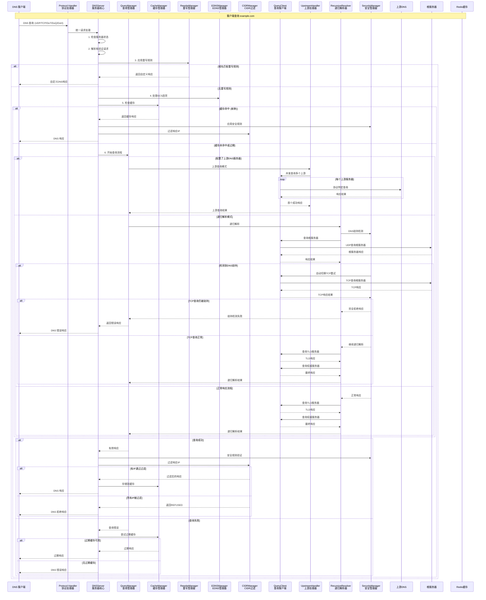
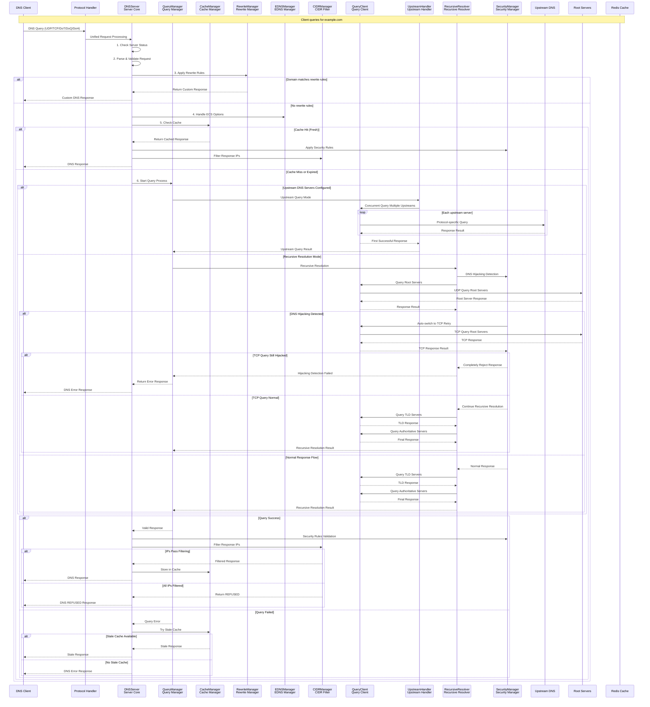

```mermaid
graph TB
    subgraph "Client Layer"
        A[DNS Client]
    end

    subgraph "Core Server"
        B[DNSServer<br>Server Core]
        C[ConfigManager<br>Config Management]
    end

    subgraph "Protocol Handlers"
        D[UDP Server<br>UDP:53]
        E[TCP Server<br>TCP:53]
        F[DoT Handler<br>DoT:853]
        G[DoQ Handler<br>DoQ:853]
        H[DoH/DoH3 Handler<br>DoH:443]
    end

    subgraph "Query Management Layer"
        I[QueryManager<br>Query Manager]
        J[QueryClient<br>Query Client]
        K[UpstreamHandler<br>Upstream Handler]
        L[RecursiveResolver<br>Recursive Resolver]
        M[CNAMEHandler<br>CNAME Handler]
        N[ResponseValidator<br>Response Validator]
    end

    subgraph "Security & Management Layer"
        O[SecurityManager<br>Security Manager]
        P[EDNSManager<br>EDNS Manager]
        Q[TLSManager<br>TLS Certificate Manager]
        R[DNSSECValidator<br>DNSSEC Validator]
        S[HijackPrevention<br>Hijack Prevention]
        T[CIDRManager<br>CIDR Filter]
        U[RewriteManager<br>DNS Rewrite]
        V[IPDetector<br>IP Detector]
    end

    subgraph "Cache System"
        W[CacheManager Interface<br>Cache Manager Interface]
        X[RedisCache<br>Redis Cache Implementation]
        Y[NullCache<br>No Cache Implementation]
    end

    subgraph "Background Task Management"
        Z[Background Group<br>Background Task Group]
        AA[Cache Refresh Group<br>Cache Refresh Group]
        BB[Shutdown Coordinator<br>Shutdown Coordinator]
        CC[Signal Handler<br>Signal Handler]
    end

    subgraph "External Dependencies"
        DD[Upstream DNS Servers<br>Upstream DNS Servers]
        EE[Redis Server<br>Redis Server]
        FF[Root DNS Servers<br>Root DNS Servers]
        GG[TLS Certificates<br>TLS Certificates]
    end

    %% Main connections
    A -->|DNS Query| D
    A -->|DNS Query| E
    A -->|Secure Query| F
    A -->|Secure Query| G
    A -->|Secure Query| H

    D --> B
    E --> B
    F --> B
    G --> B
    H --> B

    B --> C
    B --> I
    B --> O
    B --> P
    B --> W

    I --> J
    I --> K
    I --> L
    I --> M
    I --> N

    J --> Q
    J --> R
    J --> S

    O --> T
    O --> U
    O --> V

    P --> V

    W --> X
    W --> Y

    B --> Z
    B --> AA
    B --> BB
    B --> CC

    %% External connections
    K --> DD
    L --> FF
    X --> EE
    Q --> GG
    F --> GG
    G --> GG
    H --> GG

    %% Style definitions
    classDef client fill:#3498db,stroke:#2980b9,color:#fff
    classDef core fill:#2ecc71,stroke:#27ae60,color:#fff,font-weight:bold
    classDef protocol fill:#e67e22,stroke:#d35400,color:#fff
    classDef query fill:#9b59b6,stroke:#8e44ad,color:#fff
    classDef security fill:#e74c3c,stroke:#c0392b,color:#fff
    classDef cache fill:#f39c12,stroke:#d68910,color:#fff
    classDef background fill:#16a085,stroke:#138d75,color:#fff
    classDef external fill:#95a5a6,stroke:#7f8c8d,color:#fff

    class A client
    class B,C core
    class D,E,F,G,H protocol
    class I,J,K,L,M,N query
    class O,P,Q,R,S,T,U,V security
    class W,X,Y cache
    class Z,AA,BB,CC background
    class DD,EE,FF,GG external
```

# ZJDNS Server

[English](#english) | [中文](#中文)

---

<a name="中文"></a>

## 🇨🇳 中文文档

🚀 高性能递归 DNS 解析服务器，基于 Go 语言开发，支持 Redis 缓存、DNSSEC 验证、ECS、DoT/DoQ/DoH 等高级功能。

---

## ⚠️ 免责声明

> ⚠️ **警告**
> 这个项目是一个 Vibe Coding 产品，具有复杂的代码结构，尚未在生产环境中得到充分验证。请不要在生产环境中使用。

---

## 🌟 核心特性

### 🔧 DNS 解析核心

- **递归 DNS 解析**：完整的 DNS 递归查询算法实现，从根服务器开始逐步解析
- **智能协议协商**：支持 UDP 和 TCP 协议，当 UDP 响应被截断或超过缓冲区大小时**自动回退到 TCP 协议**，确保大数据响应的完整传输
- **CNAME 链解析**：智能处理 CNAME 记录链，防止循环引用，支持多级 CNAME 解析
- **DNS 重写功能**：支持精确匹配域名重写规则，实现域名过滤和重定向；支持自定义响应码（如 NXDOMAIN、SERVFAIL 等）和 DNS 记录（如 A、AAAA、CNAME 等）返回
- **混合模式**：可同时配置上游 DNS 服务器和递归解析器，实现灵活的查询策略

### 🛡️ 安全与防御

- **CIDR 过滤**：基于 CIDR 规则的智能 IP 地址过滤，支持精确的结果控制
  - **文件配置**：通过外部文件定义 CIDR 规则，支持动态加载和管理
  - **标签匹配**：使用标签系统将上游服务器与过滤规则关联，实现灵活的策略配置
  - **记录过滤**：智能过滤 A 和 AAAA 记录，只允许符合 CIDR 规则的 IP 结果通过
  - **拒绝策略**：当任何记录被过滤时，返回 REFUSED 响应，确保严格的访问控制

- **DNS 劫持防护**：主动检测并智能响应根服务器的越权响应
  - **步骤 1**：当检测到根服务器直接为非根域名返回最终记录时，判定为 DNS 劫持
  - **步骤 2**：**自动切换到 TCP 协议重试**以绕过常见的 UDP 污染
  - **步骤 3**：如果 TCP 查询结果**仍然**被劫持，完全拒绝该响应，从源头防止污染

- **DNSSEC 验证**：完整的 DNSSEC 支持和验证，可设置服务器强制验证，支持 AD 标志传播
- **ECS 支持**：EDNS 客户端子网，提供地理位置感知解析，支持 `auto`、`auto_v4`、`auto_v6` 自动检测或手动 CIDR 配置
- **递归深度保护**：防止恶意递归查询攻击，可配置最大递归深度

### 🔐 安全传输协议

- **DNS over TLS (DoT)**：支持标准 DNS over TLS 协议 (RFC 7818)，在端口 `853` 上提供加密 DNS 查询，防止窃听和篡改
- **DNS over QUIC (DoQ)**：支持前沿的 DNS over QUIC 协议，利用 QUIC 协议的 0-RTT、多路复用和连接迁移特性，提供更低延迟和更高可靠性的加密 DNS 服务
- **DNS over HTTPS (DoH/DoH3)**：同时支持 HTTP/2 和 HTTP/3 DoH 服务，在端口 `443` 上提供基于 HTTPS 的 DNS 查询
- **统一证书管理**：DoT、DoQ 和 DoH 共享相同的 TLS 证书配置，简化部署
- **自签名 CA 支持**：内置自签名 CA 功能，可为域名动态签名 TLS 证书，简化开发环境配置
- **调试证书自动生成**：在开发或调试模式下自动生成自签名 TLS 证书，无需外部证书文件
- **增强的 TLS 日志**：提供详细的 TLS 握手和证书验证日志，便于问题诊断和安全监控

### 🔧 TLS 证书管理

- **自签名根 CA**：内置自签名根证书颁发机构，支持为任何域名签名 TLS 证书
- **动态证书签发**：可根据配置的域名动态生成有效的 TLS 证书，无需外部证书文件
- **开发调试支持**：在开发环境中自动生成临时证书，简化配置过程
- **EC 密钥支持**：支持 ECDSA 私钥的生成、序列化和加载，提供更现代的加密算法
- **证书验证日志**：详细的 TLS 证书验证过程日志，包括证书链验证、有效期检查等

### 📦 DNS 填充

- **RFC 7830 标准支持**：实现 DNS 填充功能，通过在 EDNS0 中添加填充字节来标准化 DNS 响应包大小，有效对抗基于流量大小的指纹识别和审查
- **智能块大小填充**：填充到推荐的 468 字节，平衡隐私保护和带宽效率
- **按需启用**：可通过配置文件灵活启用或禁用，**仅对安全连接（DoT/DoQ/DoH）生效**

### 📍 DDR 功能

- **自动发现支持**：支持 RFC [9461](https://www.rfc-editor.org/rfc/rfc9461.html)/[9462](https://www.rfc-editor.org/rfc/rfc9462.html) DNS SVCB 记录，用于自动发现安全 DNS 服务器
- **SVCB 记录生成**：自动为 DoT、DoH、DoQ 生成 SVCB 记录，支持 IPv4 和 IPv6 提示
- **灵活配置**：通过配置文件指定 DDR 域名和对应的 IP 地址，支持 IPv4 和 IPv6 双栈配置
- **智能响应**：当接收到 `_dns.resolver.arpa`、`_dns.dns.example.org`、`_non_53_port._dns.dns.example.org` 的 SVCB 查询时，自动返回配置的加密 DNS 服务信息

### 💾 缓存系统

- **双模式运行**：
  - **无缓存模式**：适用于测试环境，零配置启动，纯递归解析
  - **Redis 缓存模式**：推荐生产环境使用，支持分布式部署，数据持久化
- **智能 TTL 管理**：灵活的 TTL 策略，支持最小/最大 TTL 限制
- **过期缓存服务**：当上游服务器不可用时提供过期缓存服务，大大提高系统可用性
- **预取机制**：后台自动刷新即将过期的缓存，减少用户等待时间
- **ECS 感知缓存**：基于客户端地理位置（EDNS Client Subnet）的缓存分区，提供精确的本地化解析
- **访问限流**：限制缓存访问时间更新操作，减少 Redis 压力

---

## 🏗️ 系统架构

```mermaid
graph TB
    subgraph "客户端层"
        A[DNS 客户端]
    end

    subgraph "核心服务器"
        B[DNSServer<br>服务器核心]
        C[ConfigManager<br>配置管理]
    end

    subgraph "协议处理器"
        D[UDP Server<br>UDP:53]
        E[TCP Server<br>TCP:53]
        F[DoT Handler<br>DoT:853]
        G[DoQ Handler<br>DoQ:853]
        H[DoH/DoH3 Handler<br>DoH:443]
    end

    subgraph "查询管理层"
        I[QueryManager<br>查询管理器]
        J[QueryClient<br>查询客户端]
        K[UpstreamHandler<br>上游处理器]
        L[RecursiveResolver<br>递归解析器]
        M[CNAMEHandler<br>CNAME处理器]
        N[ResponseValidator<br>响应验证器]
    end

    subgraph "安全与管理层"
        O[SecurityManager<br>安全管理器]
        P[EDNSManager<br>EDNS管理器]
        Q[TLSManager<br>TLS证书管理]
        R[DNSSECValidator<br>DNSSEC验证器]
        S[HijackPrevention<br>劫持防护]
        T[CIDRManager<br>CIDR过滤]
        U[RewriteManager<br>DNS重写]
        V[IPDetector<br>IP检测器]
    end

    subgraph "缓存系统"
        W[CacheManager Interface<br>缓存管理接口]
        X[RedisCache<br>Redis缓存实现]
        Y[NullCache<br>无缓存实现]
    end

    subgraph "背景任务管理"
        Z[Background Group<br>背景任务组]
        AA[Cache Refresh Group<br>缓存刷新组]
        BB[Shutdown Coordinator<br>关闭协调器]
        CC[Signal Handler<br>信号处理器]
    end

    subgraph "外部依赖"
        DD[Upstream DNS Servers<br>上游DNS服务器]
        EE[Redis Server<br>Redis服务器]
        FF[Root DNS Servers<br>根DNS服务器]
        GG[TLS Certificates<br>TLS证书]
    end

    %% Main connections
    A -->|DNS 查询| D
    A -->|DNS 查询| E
    A -->|安全查询| F
    A -->|安全查询| G
    A -->|安全查询| H

    D --> B
    E --> B
    F --> B
    G --> B
    H --> B

    B --> C
    B --> I
    B --> O
    B --> P
    B --> W

    I --> J
    I --> K
    I --> L
    I --> M
    I --> N

    J --> Q
    J --> R
    J --> S

    O --> T
    O --> U
    O --> V

    P --> V

    W --> X
    W --> Y

    B --> Z
    B --> AA
    B --> BB
    B --> CC

    %% External connections
    K --> DD
    L --> FF
    X --> EE
    Q --> GG
    F --> GG
    G --> GG
    H --> GG

    %% Style definitions
    classDef client fill:#3498db,stroke:#2980b9,color:#fff
    classDef core fill:#2ecc71,stroke:#27ae60,color:#fff,font-weight:bold
    classDef protocol fill:#e67e22,stroke:#d35400,color:#fff
    classDef query fill:#9b59b6,stroke:#8e44ad,color:#fff
    classDef security fill:#e74c3c,stroke:#c0392b,color:#fff
    classDef cache fill:#f39c12,stroke:#d68910,color:#fff
    classDef background fill:#16a085,stroke:#138d75,color:#fff
    classDef external fill:#95a5a6,stroke:#7f8c8d,color:#fff

    class A client
    class B,C core
    class D,E,F,G,H protocol
    class I,J,K,L,M,N query
    class O,P,Q,R,S,T,U,V security
    class W,X,Y cache
    class Z,AA,BB,CC background
    class DD,EE,FF,GG external
```



---

## 🔍 DNS 查询流程



---

## 📋 使用示例

### 生成示例配置文件

```bash
./zjdns -generate-config > config.json
```

### 启动服务器

```bash
# 使用默认配置（纯递归模式，无缓存）
./zjdns

# 使用配置文件启动（推荐）
./zjdns -config config.json
```

### 测试 DNS 解析

```bash
# 传统DNS测试
kdig @127.0.0.1 -p 53 example.com

# DoT测试
kdig @127.0.0.1 -p 853 example.com +tls

# DoQ测试
kdig @127.0.0.1 -p 853 example.com +quic

# DoH测试
kdig @127.0.0.1 -p 443 example.com +https
```

### 性能监控

```bash
# 启用pprof性能分析
curl http://127.0.0.1:6060/debug/pprof/

# 查看内存使用情况
curl http://127.0.0.1:6060/debug/pprof/heap
```

---

## 🛠️ 开发工具

### golangci-lint

提交代码前，请使用 [golangci-lint](https://golangci-lint.run/) 进行代码检查。

**安装 golangci-lint：**

```bash
brew install golangci-lint
```

**运行检查和代码格式化：**

```bash
golangci-lint run && golangci-lint fmt
```

请确保 golangci-lint 检查通过后再提交代码，以保持代码质量和一致性。

### 构建和测试

```bash
# 构建二进制文件
go build -o zjdns

# 生成配置示例
./zjdns -generate-config
```

---

## 📝 许可证

本项目采用 MIT 许可证。详情请参见 [LICENSE](LICENSE) 文件。

---

## 🙏 致谢

感谢以下开源项目：

- [miekg/dns](https://github.com/miekg/dns) - Go DNS library
- [redis/go-redis](https://github.com/redis/go-redis) - Redis Go client
- [quic-go/quic-go](https://github.com/quic-go/quic-go) - QUIC protocol implementation

---

<a name="english"></a>

## 🇺🇸 English Documentation

🚀 High-performance recursive DNS resolution server written in Go, supporting Redis caching, DNSSEC validation, ECS, DoT/DoQ/DoH and other advanced features.

---

## ⚠️ Disclaimer

> ⚠️ **Warning**
> This project is a Vibe Coding product with complex code structure and hasn't been thoroughly verified in production environments. Please do not use it in production.

---

## 🌟 Core Features

### 🔧 DNS Resolution Core

- **Recursive DNS Resolution**: Complete implementation of DNS recursive query algorithm, resolving step by step from root servers
- **Intelligent Protocol Negotiation**: Supports both UDP and TCP protocols, **automatically falls back to TCP protocol when UDP responses are truncated or exceed buffer size**, ensuring complete transmission of large response data
- **CNAME Chain Resolution**: Intelligently handles CNAME record chains, prevents circular references, supports multi-level CNAME resolution
- **DNS Rewrite Functionality**: Supports exact match domain rewrite rules, enabling domain filtering and redirection; supports custom response codes (such as NXDOMAIN, SERVFAIL, etc.) and DNS records (such as A, AAAA, CNAME, etc.) return
- **Hybrid Mode**: Can configure both upstream DNS servers and recursive resolvers simultaneously, enabling flexible query strategies

### 🛡️ Security and Defense

- **CIDR Filtering**: Intelligent IP address filtering based on CIDR rules, supporting precise result control
  - **File Configuration**: Define CIDR rules through external files, supporting dynamic loading and management
  - **Label Matching**: Use label system to associate upstream servers with filtering rules, enabling flexible policy configuration
  - **Record Filtering**: Intelligently filter A and AAAA records, only allowing IP results that comply with CIDR rules to pass through
  - **Rejection Policy**: When any record is filtered, returns REFUSED response, ensuring strict access control

- **DNS Hijacking Prevention**: Proactively detects and intelligently responds to overreaching responses from root servers
  - **Step 1**: When detecting that root servers directly return final records for non-root domains, it's determined as DNS hijacking
  - **Step 2**: **Automatically switches to TCP protocol for retry** to bypass common UDP pollution
  - **Step 3**: If TCP query results are **still** hijacked, completely reject the response, preventing pollution from the source

- **DNSSEC Validation**: Complete DNSSEC support and validation, can set server mandatory validation, supports AD flag propagation
- **ECS Support**: EDNS Client Subnet, providing geolocation-aware resolution, supports `auto`, `auto_v4`, `auto_v6` auto-detection or manual CIDR configuration
- **Recursion Depth Protection**: Prevents malicious recursive query attacks, configurable maximum recursion depth

### 🔐 Secure Transport Protocols

- **DNS over TLS (DoT)**: Supports standard DNS over TLS protocol (RFC 7818), providing encrypted DNS queries on port `853`, preventing eavesdropping and tampering
- **DNS over QUIC (DoQ)**: Supports cutting-edge DNS over QUIC protocol, leveraging QUIC protocol's 0-RTT, multiplexing, and connection migration features to provide lower latency and higher reliability encrypted DNS services
- **DNS over HTTPS (DoH/DoH3)**: Simultaneously supports HTTP/2 and HTTP/3 DoH services, providing HTTPS-based DNS queries on port `443`
- **Unified Certificate Management**: DoT, DoQ, and DoH share the same TLS certificate configuration, simplifying deployment
- **Self-signed CA Support**: Built-in self-signed CA functionality, can dynamically sign TLS certificates for domains, simplifying development environment configuration
- **Debug Certificate Auto-generation**: Automatically generates self-signed TLS certificates in development or debug mode, no external certificate files required
- **Enhanced TLS Logging**: Provides detailed TLS handshake and certificate validation logs, facilitating problem diagnosis and security monitoring

### 🔧 TLS Certificate Management

- **Self-signed Root CA**: Built-in self-signed root certificate authority, supports signing TLS certificates for any domain
- **Dynamic Certificate Issuance**: Can dynamically generate valid TLS certificates based on configured domains, no external certificate files required
- **Development Debug Support**: Automatically generates temporary certificates in development environments, simplifying the configuration process
- **EC Key Support**: Supports generation, serialization, and loading of ECDSA private keys, providing more modern encryption algorithms
- **Certificate Validation Logs**: Detailed TLS certificate validation process logs, including certificate chain validation, validity period checks, etc.

### 📦 DNS Padding

- **RFC 7830 Standard Support**: Implements DNS Padding functionality, standardizing DNS response packet sizes by adding padding bytes in EDNS0, effectively combating fingerprinting and censorship based on traffic size
- **Smart Block Size Padding**: Pads to recommended 468 bytes, balancing privacy protection and bandwidth efficiency
- **On-demand Enablement**: Can be flexibly enabled or disabled through configuration file, **only effective for secure connections (DoT/DoQ/DoH)**

### 📍 DDR (Discovery of Designated Resolvers) Functionality

- **Auto-discovery Support**: Supports RFC [9461](https://www.rfc-editor.org/rfc/rfc9461.html)/[9462](https://www.rfc-editor.org/rfc/rfc9462.html) DNS SVCB records for automatic discovery of secure DNS servers
- **SVCB Record Generation**: Automatically generates SVCB records for DoT, DoH, DoQ, supporting IPv4 and IPv6 hints
- **Flexible Configuration**: Specify DDR domain names and corresponding IP addresses through configuration file, supporting IPv4 and IPv6 dual-stack configuration
- **Intelligent Response**: When receiving SVCB queries for `_dns.resolver.arpa`, `_dns.dns.example.org`, `_non_53_port._dns.dns.example.org`, automatically returns configured encrypted DNS service information

### 💾 Cache System

- **Dual Mode Operation**:
  - **No Cache Mode**: Suitable for testing environments, zero-configuration startup, pure recursive resolution
  - **Redis Cache Mode**: Recommended for production environments, supports distributed deployment, data persistence
- **Intelligent TTL Management**: Flexible TTL strategies, supports minimum/maximum TTL limits
- **Stale Cache Serving**: Provides stale cache service when upstream servers are unavailable, greatly improving system availability
- **Prefetch Mechanism**: Background automatic refresh of soon-to-expire cache, reducing user waiting time
- **ECS-aware Caching**: Cache partitioning based on client geographic location (EDNS Client Subnet), providing precise localized resolution
- **Access Throttling**: Throttles cache access time update operations, reducing Redis pressure

---

## 🏗️ System Architecture



---

## 🔍 DNS Query Process



---

## 📋 Usage Examples

### Generate Example Configuration File

```bash
./zjdns -generate-config > config.json
```

### Start Server

```bash
# Use default configuration (pure recursive mode, no cache)
./zjdns

# Start with configuration file (recommended)
./zjdns -config config.json
```

### Test DNS Resolution

```bash
# Traditional DNS test
kdig @127.0.0.1 -p 53 example.com

# DoT test
kdig @127.0.0.1 -p 853 example.com +tls

# DoQ test
kdig @127.0.0.1 -p 853 example.com +quic

# DoH test
kdig @127.0.0.1 -p 443 example.com +https
```

### Performance Monitoring

```bash
# Enable pprof performance analysis
curl http://127.0.0.1:6060/debug/pprof/

# View memory usage
curl http://127.0.0.1:6060/debug/pprof/heap
```

---

## 🛠️ Development Tools

### golangci-lint

Before committing code, please use [golangci-lint](https://golangci-lint.run/) for code checking.

**Install golangci-lint:**

```bash
brew install golangci-lint
```

**Run checks & code formatting:**

```bash
golangci-lint run && golangci-lint fmt
```

Please ensure golangci-lint checks pass before committing code to maintain code quality and consistency.

### Build and Test

```bash
# Build binary
go build -o zjdns

# Generate config example
./zjdns -generate-config
```

---

## 📝 License

This project is licensed under the MIT License. See the [LICENSE](LICENSE) file for details.

---

## 🙏 Acknowledgments

Thanks to the following open source projects:

- [miekg/dns](https://github.com/miekg/dns) - Go DNS library
- [redis/go-redis](https://github.com/redis/go-redis) - Redis Go client
- [quic-go/quic-go](https://github.com/quic-go/quic-go) - QUIC protocol implementation

---

[↑ Back to top](#zjdns-server)
