# ZJDNS Server

🚀 High-performance recursive DNS resolution server written in Go, supporting Redis caching, DNSSEC validation, ECS, DoT/DoQ/DoH and other advanced features.

> ⚠️ **Warning**
> This project is a Vibe Coding product with complex code structure and hasn't been thoroughly verified in production environments. Please do not use it in production.

---

## ✨ Features

### 🔧 Core Features

- **Recursive DNS Resolution**: Complete implementation of DNS recursive query algorithm, resolving step by step from root servers
- **Smart Root Server Management**: Automatically manages 13 IPv4 and 13 IPv6 root servers, dynamically sorts based on real-time network latency testing, prioritizing optimal servers for queries
- **Intelligent Protocol Negotiation**: Supports both UDP and TCP protocols, **automatically falls back to TCP protocol when UDP responses are truncated or exceed buffer size**, ensuring complete transmission of large response data
- **CNAME Chain Resolution**: Intelligently handles CNAME record chains, prevents circular references, supports multi-level CNAME resolution
- **Concurrent Queries**: High-performance concurrent processing with connection pool management
- **DNS Rewrite Functionality**: Supports exact match domain rewrite rules, enabling domain filtering and redirection; supports custom response codes (such as NXDOMAIN, SERVFAIL, etc.) and DNS records (such as A, AAAA, CNAME, etc.) return
- **Hybrid Mode**: Can configure both upstream DNS servers and recursive resolvers simultaneously, enabling flexible query strategies
- **Network Quality-Aware Sorting**: Performs network latency testing on resolution results and sorts by quality, prioritizing results with the best network quality

### 🛡️ Security and Defense Features

- **CIDR Filtering**: Intelligent IP address filtering based on CIDR rules, supporting precise result control.
  - **File Configuration**: Define CIDR rules through external files, supporting dynamic loading and management.
  - **Label Matching**: Use label system to associate upstream servers with filtering rules, enabling flexible policy configuration.
  - **Record Filtering**: Intelligently filter A and AAAA records, only allowing IP results that comply with CIDR rules to pass through.
  - **Rejection Policy**: When any record is filtered, returns REFUSED response, ensuring strict access control.
- **DNS Hijacking Prevention**: Proactively detects and intelligently responds to overreaching responses from root servers.
  - **Step 1**: When detecting that root servers directly return final records for non-root domains, it's determined as DNS hijacking.
  - **Step 2**: **Automatically switches to TCP protocol for retry** to bypass common UDP pollution.
  - **Step 3**: If TCP query results are **still** hijacked, completely reject the response, preventing pollution from the source.
- **DNSSEC Validation**: Complete DNSSEC support and validation, can set server mandatory validation, supports AD flag propagation
- **ECS Support**: EDNS Client Subnet, providing geolocation-aware resolution, supports `auto`, `auto_v4`, `auto_v6` auto-detection or manual CIDR configuration
- **Recursion Depth Protection**: Prevents malicious recursive query attacks, configurable maximum recursion depth

### 🔐 Secure Transport Protocols

- **DNS over TLS (DoT)**: Supports standard DNS over TLS protocol (RFC 7818), providing encrypted DNS queries on port `853`, preventing eavesdropping and tampering.
- **DNS over QUIC (DoQ)**: Supports cutting-edge DNS over QUIC protocol, leveraging QUIC protocol's 0-RTT, multiplexing, and connection migration features to provide lower latency and higher reliability encrypted DNS services.
- **DNS over HTTPS (DoH/DoH3)**: Simultaneously supports HTTP/2 and HTTP/3 DoH services, providing HTTPS-based DNS queries on port `443`.
- **Unified Certificate Management**: DoT, DoQ, and DoH share the same TLS certificate configuration, simplifying deployment.
- **Self-signed CA Support**: Built-in self-signed CA functionality, can dynamically sign TLS certificates for domains, simplifying development environment configuration.
- **Debug Certificate Auto-generation**: Automatically generates self-signed TLS certificates in development or debug mode, no external certificate files required.
- **Enhanced TLS Logging**: Provides detailed TLS handshake and certificate validation logs, facilitating problem diagnosis and security monitoring.

### 🔧 TLS Certificate Management

- **Self-signed Root CA**: Built-in self-signed root certificate authority, supports signing TLS certificates for any domain.
- **Dynamic Certificate Issuance**: Can dynamically generate valid TLS certificates based on configured domains, no external certificate files required.
- **Development Debug Support**: Automatically generates temporary certificates in development environments, simplifying configuration process.
- **EC Key Support**: Supports generation, serialization, and loading of ECDSA private keys, providing more modern encryption algorithms.
- **Certificate Validation Logs**: Detailed TLS certificate validation process logs, including certificate chain validation, validity period checks, etc.

### 📦 DNS Padding

- **RFC 7830 Standard Support**: Implements DNS Padding functionality, standardizing DNS response packet sizes by adding padding bytes in EDNS0, effectively combating fingerprinting and censorship based on traffic size.
- **Smart Block Size Padding**: Pads to recommended 468 bytes, balancing privacy protection and bandwidth efficiency.
- **On-demand Enablement**: Can be flexibly enabled or disabled through configuration file, **only effective for secure connections (DoT/DoQ/DoH)**.

### 📍 DDR (Discovery of Designated Resolvers) Functionality

- **Auto-discovery Support**: Supports RFC [9461](https://www.rfc-editor.org/rfc/rfc9461.html)/[9462](https://www.rfc-editor.org/rfc/rfc9462.html) DNS SVCB records for automatic discovery of secure DNS servers
- **SVCB Record Generation**: Automatically generates SVCB records for DoT, DoH, DoQ, supporting IPv4 and IPv6 hints
- **Flexible Configuration**: Specify DDR domain names and corresponding IP addresses through configuration file, supporting IPv4 and IPv6 dual-stack configuration
- **Intelligent Response**: When receiving SVCB queries for `_dns.resolver.arpa`, `_dns.dns.example.org`, `_non_53_port._dns.dns.example.org`, automatically returns configured encrypted DNS service information

### 🚀 Network Quality Testing (SpeedTest)

- **Multi-protocol Support**: Supports various protocols including ICMP, TCP, and UDP for network quality testing
- **Flexible Configuration**: Configurable different test ports and timeout values, adapting to different network environments
- **Intelligent Sorting**: Sorts DNS resolution results by latency based on test results, prioritizing results with the best network quality
- **Caching Mechanism**: Built-in test result caching, avoiding duplicate tests and improving response speed
- **Concurrent Processing**: Supports concurrent testing of multiple IP addresses, improving test efficiency

### 💾 Cache System

- **Dual Mode Operation**:
  - **No Cache Mode**: Suitable for testing environments, zero-configuration startup, pure recursive resolution
  - **Redis Cache Mode**: Recommended for production environments, supports distributed deployment, data persistence
- **Intelligent TTL Management**: Flexible TTL strategies, supports minimum/maximum TTL limits
- **Stale Cache Serving**: Provides stale cache service when upstream servers are unavailable, greatly improving system availability
- **Prefetch Mechanism**: Background automatic refresh of soon-to-expire cache, reducing user waiting time
- **ECS-aware Caching**: Cache partitioning based on client geographic location (EDNS Client Subnet), providing precise localized resolution
- **Access Throttling**: Throttles cache access time update operations, reducing Redis pressure

### 🕵️ Request Tracking System

- **Full-chain Tracing**: Generates unique ID for each DNS request, detailed recording of each step and time consumption during processing.
- **Intelligent Logging**: At `DEBUG` level, outputs timestamped request processing steps, greatly simplifying debugging and performance analysis.
- **Summary Report**: At `INFO` level, outputs request processing summary, including cache hit status, total time, upstream servers used, and other key information.

---

## 🏗️ System Architecture

ZJDNS adopts modular, layered design with clear responsibilities and loose coupling of core components, supporting high concurrency and multiple security protocols. Overall architecture is as follows:

```mermaid
graph TB
    subgraph "Client Layer"
        A[DNS Client<br><i>Client Device</i>]
    end

    subgraph "Core Service Layer"
        B[DNSServer<br><i>Server Core</i>]
        C[ConfigManager<br><i>Config Management</i>]
        D[ConnectionManager<br><i>Connection Management</i>]
        E[CacheManager<br><i>Cache Manager</i>]
        F[QueryManager<br><i>Query Manager</i>]
        G[UpstreamHandler<br><i>Upstream Handler</i>]
    end

    subgraph "Protocol Processing Layer"
        H[UDPServer<br><i>UDP:53</i>]
        I[TCPServer<br><i>TCP:53</i>]
        J[DoTHandler<br><i>DoT:853</i>]
        K[DoQHandler<br><i>DoQ:784/8853</i>]
        L[DoHHandler<br><i>DoH:443</i>]
    end

    subgraph "DNS Processing Engine"
        M[RecursiveResolver<br><i>Recursive Resolver</i>]
        N[CNAMEHandler<br><i>CNAME Handler</i>]
        O[ResponseValidator<br><i>Response Validator</i>]
        P[QueryClient<br><i>Query Client</i>]
    end

    subgraph "Security & Enhancement Layer"
        Q[SecurityManager<br><i>Security Manager</i>]
        R[EDNSManager<br><i>EDNS Manager</i>]
        S[DNSSECValidator<br><i>DNSSEC Validator</i>]
        T[HijackPrevention<br><i>Hijack Prevention</i>]
        U[CIDRManager<br><i>CIDR Filtering</i>]
        V[RewriteManager<br><i>DNS Rewrite</i>]
        W[SpeedTestManager<br><i>Network Testing</i>]
    end

    subgraph "Cache System"
        X[RedisCache<br><i>Redis Cache</i>]
        Y[NullCache<br><i>No Cache Mode</i>]
        Z[Prefetch Mechanism<br><i>Cache Prefetch</i>]
        AA[ServeStale<br><i>Stale Cache Service</i>]
    end

    subgraph "Infrastructure Layer"
        BB[RequestTracker<br><i>Request Tracking</i>]
        CC[TaskManager<br><i>Task Management</i>]
        DD[TLSManager<br><i>TLS Certificate Management</i>]
        EE[RootServerManager<br><i>Root Server Management</i>]
        FF[IPDetector<br><i>IP Detector</i>]
        GG[LogManager<br><i>Log Management</i>]
    end

    subgraph "External Services"
        HH[Root Servers<br><i>Root Servers</i>]
        II[Upstream DNS<br><i>Upstream DNS</i>]
        JJ[Redis Cluster<br><i>Redis Cluster</i>]
        KK[Self-signed CA<br><i>Self-signed CA</i>]
        LL[TLS Certificates<br><i>TLS Certificates</i>]
    end

    %% Main connections
    A -->|DNS Query| H
    A -->|DNS Query| I
    A -->|Secure Query| J
    A -->|Secure Query| K
    A -->|Secure Query| L

    H --> B
    I --> B
    J --> B
    K --> B
    L --> B

    B --> M
    B --> N
    B --> O
    B --> P

    M --> Q
    M --> R
    M --> S
    M --> T
    M --> U
    M --> V
    M --> W

    P --> EE
    B --> X
    B --> Y
    X --> Z
    X --> AA

    B --> BB
    B --> CC
    B --> DD
    B --> FF
    B --> GG

    %% External connections
    EE --> HH
    G --> II
    X --> JJ
    DD --> KK
    DD --> LL
    J --> LL
    K --> LL
    L --> LL

    %% Style definitions
    classDef client fill:#3498db,stroke:#2980b9,color:#fff
    classDef core fill:#2ecc71,stroke:#27ae60,color:#fff,font-weight:bold
    classDef protocol fill:#e67e22,stroke:#d35400,color:#fff
    classDef engine fill:#9b59b6,stroke:#8e44ad,color:#fff
    classDef security fill:#e74c3c,stroke:#c0392b,color:#fff
    classDef cache fill:#f39c12,stroke:#d68910,color:#fff
    classDef infra fill:#34495e,stroke:#2c3e50,color:#fff
    classDef external fill:#95a5a6,stroke:#7f8c8d,color:#fff

    class A client
    class B,C,D,E,F,G core
    class H,I,J,K,L protocol
    class M,N,O,P engine
    class Q,R,S,T,U,V,W security
    class X,Y,Z,AA cache
    class BB,CC,DD,EE,FF,GG infra
    class HH,II,JJ,KK,LL external
```



---

## 📋 Usage Examples

### Generate Example Configuration File

```bash
./zjdns -generate-config > config.json
```

### Start Server

```bash
# Use default configuration (pure recursive mode, no cache)
./zjdns

# Start with configuration file (recommended)
./zjdns -config config.json
```

---

## 📝 License

This project is licensed under the MIT License. See the [LICENSE](LICENSE) file for details.

---

## 🛠️ Development Tools

### golangci-lint

Before committing code, please use [golangci-lint](https://golangci-lint.run/) for code checking.

Install golangci-lint:

```bash
brew install golangci-lint
```

Run checks & code formatting:

```bash
golangci-lint run & golangci-lint fmt
```

Please ensure golangci-lint checks pass before committing code to maintain code quality and consistency.

---

## 🙏 Acknowledgments

Thanks to the following open source projects:

- [miekg/dns](https://github.com/miekg/dns) - Go DNS library
- [redis/go-redis](https://github.com/redis/go-redis) - Redis Go client
- [quic-go/quic-go](https://github.com/quic-go/quic-go) - QUIC protocol implementation
- [hypermodeinc/ristretto](https://github.com/hypermodeinc/ristretto) - High-performance Go cache
