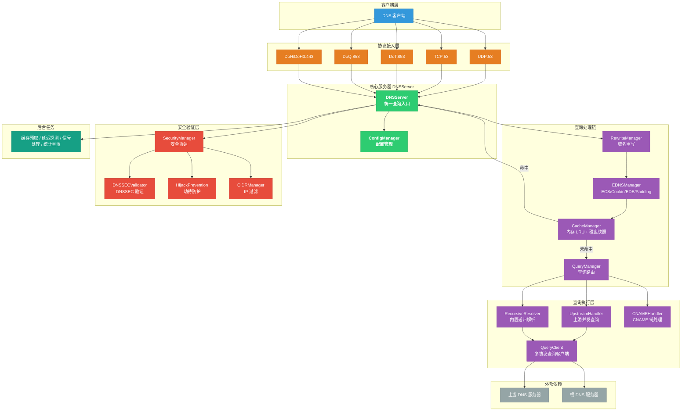
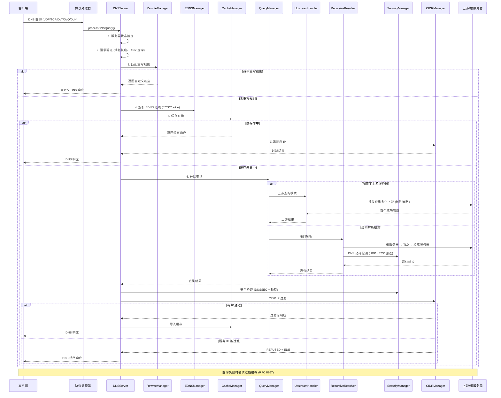

# ZJDNS Server

🚀 高性能递归 DNS 解析服务器，基于 Go 语言开发，支持高性能 LRU 内存缓存（可落盘持久化）、DNSSEC 验证、ECS、DoT/DoQ/DoH/DoH3 等高级功能。

> ⚠️ **警告**
> 这个项目是一个 Vibe Coding 产品，具有复杂的代码结构，尚未在生产环境中得到充分验证。请不要在生产环境中使用。

---

## 🌟 核心特性

### 🔧 DNS 解析核心

- **递归 DNS 解析**：完整的 DNS 递归查询算法实现，从 13 组根服务器开始逐步解析，支持 TLD 服务器和权威服务器查询
- **上游 DNS 转发**：支持配置多个上游 DNS 服务器，采用并发查询+首胜策略（First-Win），降低查询延迟
- **混合模式**：可同时配置上游 DNS 服务器和内置递归解析器（`builtin_recursive`），实现灵活的查询策略
- **智能协议协商**：UDP 响应被截断或超过缓冲区大小时**自动回退到 TCP 协议**，确保大数据响应的完整传输
- **CNAME 链解析**：智能处理多级 CNAME 记录链，防止循环引用（最大 16 级）
- **A/AAAA 延迟探测**：后台对 A/AAAA 记录进行速度检测，支持 `ping`、`tcp`、`udp`、`http`、`https`、`http3` 探测，按最快顺序重排序记录
- **DNS 重写**：支持精确匹配域名重写规则，实现域名过滤和重定向；支持自定义响应码（NXDOMAIN、SERVFAIL 等）和 DNS 记录（A、AAAA、CNAME、TXT 等）
- **客户端过滤**：重写规则支持 `include_clients` / `exclude_clients`，按客户端 IP/CIDR 选择性应用

### 🛡️ 安全与防御

- **CIDR 过滤**：基于 CIDR 规则的智能 IP 地址过滤
  - **文件/内联配置**：通过外部文件或内联 rules 定义 CIDR 规则
  - **标签匹配**：使用标签系统将上游服务器与过滤规则关联
  - **记录过滤**：过滤 A/AAAA 记录，所有 IP 被过滤时返回 REFUSED + EDE
- **DNS 劫持防护**：主动检测根服务器越权响应
  1. 检测到根服务器直接为非根域名返回最终记录 → 判定为劫持
  2. **自动切换到 TCP 协议重试**以绕过 UDP 污染
  3. TCP 仍被劫持 → 完全拒绝响应（REFUSED + EDE）
- **DNSSEC 验证**（轻量级）：
  - AD 标志检查：验证 Authenticated Data 标志
  - DNSSEC 记录检查：检测 RRSIG、NSEC、NSEC3、DNSKEY、DS 记录
  - 验证通过时向客户端传播 AD 标志
- **ECS 支持**：EDNS 客户端子网，支持 `auto`、`auto_v4`、`auto_v6` 自动检测或手动 CIDR 配置
- **DNS Cookie**：HMAC-SHA256 服务端 Cookie 生成和验证，防范 DNS 放大攻击，支持密钥无缝轮换
- **扩展 DNS错误 (EDE)**：24 种 EDE 代码，包括 Stale、Blocked、Censored、DNSSEC Bogus 等

### 🔐 安全传输协议

| 协议                       | 端口 | 说明                            |
| -------------------------- | ---- | ------------------------------- |
| **DoT** (DNS over TLS)     | 853  | TLS 1.2/1.3 加密 DNS 查询       |
| **DoQ** (DNS over QUIC)    | 853  | 基于 QUIC 协议，0-RTT、多路复用 |
| **DoH** (DNS over HTTPS)   | 443  | HTTP/2 加密 DNS 查询            |
| **DoH3** (DNS over HTTP/3) | 443  | HTTP/3 加密 DNS 查询            |

- **统一证书管理**：DoT、DoQ、DoH、DoH3 共享相同的 TLS 证书配置
- **自签名 CA**：内置自签名根 CA，使用 ECDSA P-384 密钥，可为任何域名动态签发证书
- **自定义证书**：支持加载外部 PEM 格式证书和私钥

### 📦 DNS 填充 (RFC 7830)

- 填充到 468 字节，对抗基于流量大小的指纹识别
- **仅对安全连接**（DoT/DoQ/DoH）生效

### 📍 DDR 自动发现 (RFC 9461/9462)

- 自动生成 SVCB 记录，用于 DoT/DoH/DoQ 服务发现
- 支持 IPv4 和 IPv6 双栈提示

### 💾 缓存系统

| 模式            | 说明                                     |
| --------------- | ---------------------------------------- |
| **MemoryCache** | 纯 LRU 内存缓存 + 可选定时磁盘快照持久化 |

**持久化行为**：

- **启动恢复**：从快照文件加载缓存（自动跳过过旧/无效记录）
- **后台持久化**：按 `server.features.cache.memory.persist.interval` 定时落盘
- **安全写入**：写入临时文件后原子替换，降低损坏风险

**缓存特性**：

- **过期缓存服务** (RFC 8767)：上游不可用时返回过期缓存，最大过期 30 天，客户端超时 1800ms
- **预取机制**：后台刷新即将过期的缓存记录
- **ECS 感知缓存**：基于客户端子网的缓存分区
- **PTR 反查优化**：利用缓存中 A/AAAA 记录直接生成 PTR 响应
- **高性能内存路径**：所有读写请求均为本地内存路径

### 📊 统计与监控

- 请求计数器（按协议：UDP、TCP、DoT、DoQ、DoH、DoH3）
- 缓存命中率、重写次数、劫持检测次数、过期响应次数
- 平均响应时间、Fallback 服务器使用统计
- 纯内存统计 + 定期重置（可配置 `stats.reset_interval`）
- **pprof 性能分析**：`http://127.0.0.1:6060/debug/pprof/`

---

## 📜 支持的 RFC 标准

| RFC                                                     | 标准名称                          | 实现功能                 |
| ------------------------------------------------------- | --------------------------------- | ------------------------ |
| [RFC 3597](https://www.rfc-editor.org/rfc/rfc3597.html) | Handling Unknown DNS RR Types     | 未知记录类型回退处理     |
| [RFC 7830](https://www.rfc-editor.org/rfc/rfc7830.html) | EDNS(0) Padding                   | DNS 响应填充（468 字节） |
| [RFC 7858](https://www.rfc-editor.org/rfc/rfc7858.html) | DNS over TLS (DoT)                | TLS 加密 DNS 传输        |
| [RFC 7871](https://www.rfc-editor.org/rfc/rfc7871.html) | EDNS Client Subnet (ECS)          | 客户端子网传递           |
| [RFC 7873](https://www.rfc-editor.org/rfc/rfc7873.html) | DNS Cookies                       | DNS Cookie 机制          |
| [RFC 8484](https://www.rfc-editor.org/rfc/rfc8484.html) | DNS over HTTPS (DoH)              | HTTPS 加密 DNS 传输      |
| [RFC 8767](https://www.rfc-editor.org/rfc/rfc8767.html) | Serving Stale DNS Answers         | 过期缓存服务             |
| [RFC 8914](https://www.rfc-editor.org/rfc/rfc8914.html) | Extended DNS Errors (EDE)         | 扩展 DNS 错误码          |
| [RFC 9018](https://www.rfc-editor.org/rfc/rfc9018.html) | DNS Cookies for TLS               | TLS 连接上的 DNS Cookie  |
| [RFC 9250](https://www.rfc-editor.org/rfc/rfc9250.html) | DNS over QUIC (DoQ)               | QUIC 加密 DNS 传输       |
| [RFC 9461](https://www.rfc-editor.org/rfc/rfc9461.html) | SVCB/HTTPS RR for DNS             | DDR SVCB 记录            |
| [RFC 9462](https://www.rfc-editor.org/rfc/rfc9462.html) | Discovery of Designated Resolvers | DDR 自动发现             |

---

## 🏗️ 系统架构


```mermaid
graph TB
    subgraph "客户端层"
        A[DNS 客户端]
    end

    subgraph "协议接入层"
        D[UDP:53]
        E[TCP:53]
        F[DoT:853]
        G[DoQ:853]
        H[DoH/DoH3:443]
    end

    subgraph "核心服务器 DNSServer"
        B[DNSServer<br>统一查询入口]
        C[ConfigManager<br>配置管理]
    end

    subgraph "查询处理链"
        RM[RewriteManager<br>域名重写]
        EM[EDNSManager<br>ECS/Cookie/EDE/Padding]
        CM[CacheManager<br>内存 LRU + 磁盘快照]
        QM[QueryManager<br>查询路由]
    end

    subgraph "查询执行层"
        UH[UpstreamHandler<br>上游并发查询]
        RR[RecursiveResolver<br>内置递归解析]
        CH[CNAMEHandler<br>CNAME 链处理]
        QC[QueryClient<br>多协议查询客户端]
    end

    subgraph "安全验证层"
        SM[SecurityManager<br>安全协调]
        DS[DNSSECValidator<br>DNSSEC 验证]
        HP[HijackPrevention<br>劫持防护]
        CIDR[CIDRManager<br>IP 过滤]
    end

    subgraph "外部依赖"
        EE[上游 DNS 服务器]
        GG[根 DNS 服务器]
    end

    subgraph "后台任务"
        BG[缓存预取 / 延迟探测 / 信号处理 / 统计重置]
    end

    A --> D & E & F & G & H
    D & E & F & G & H --> B
    B --> C
    B --> RM --> EM --> CM
    CM -->|命中| B
    CM -->|未命中| QM
    QM --> UH --> QC --> EE
    QM --> RR --> QC --> GG
    QM --> CH
    B --> SM --> DS & HP & CIDR
    B --> BG

    classDef client fill:#3498db,stroke:#2980b9,color:#fff
    classDef protocol fill:#e67e22,stroke:#d35400,color:#fff
    classDef core fill:#2ecc71,stroke:#27ae60,color:#fff,font-weight:bold
    classDef query fill:#9b59b6,stroke:#8e44ad,color:#fff
    classDef security fill:#e74c3c,stroke:#c0392b,color:#fff
    classDef external fill:#95a5a6,stroke:#7f8c8d,color:#fff
    classDef bg fill:#16a085,stroke:#138d75,color:#fff

    class A client
    class D,E,F,G,H protocol
    class B,C core
    class RM,EM,CM,QM query
    class UH,RR,CH,QC query
    class SM,DS,HP,CIDR security
    class EE,GG external
    class BG bg
```

---

## 🔍 DNS 查询流程


```mermaid
sequenceDiagram
    participant C as 客户端
    participant P as 协议处理器
    participant S as DNSServer
    participant RM as RewriteManager
    participant EM as EDNSManager
    participant CM as CacheManager
    participant QM as QueryManager
    participant UH as UpstreamHandler
    participant RR as RecursiveResolver
    participant SM as SecurityManager
    participant CIDR as CIDRManager
    participant US as 上游/根服务器

    C->>P: DNS 查询 (UDP/TCP/DoT/DoQ/DoH)
    P->>S: processDNSQuery()
    S->>S: 1. 服务器状态检查
    S->>S: 2. 请求验证 (域名长度、ANY 查询)
    S->>RM: 3. 匹配重写规则
    alt 命中重写规则
        RM-->>S: 返回自定义响应
        S-->>C: 自定义 DNS 响应
    else 无重写规则
        S->>EM: 4. 解析 EDNS 选项 (ECS/Cookie)
        S->>CM: 5. 缓存查询
        alt 缓存命中
            CM-->>S: 返回缓存响应
            S->>CIDR: 过滤响应 IP
            CIDR-->>S: 过滤结果
            S-->>C: DNS 响应
        else 缓存未命中
            S->>QM: 6. 开始查询
            alt 配置了上游服务器
                QM->>UH: 上游查询模式
                UH->>US: 并发查询多个上游 (首胜策略)
                US-->>UH: 首个成功响应
                UH-->>QM: 上游结果
            else 递归解析模式
                QM->>RR: 递归解析
                RR->>US: 根服务器 → TLD → 权威服务器
                RR->>SM: DNS 劫持检测 (UDP→TCP 回退)
                US-->>RR: 最终响应
                RR-->>QM: 递归结果
            end
            QM-->>S: 查询结果
            S->>SM: 安全验证 (DNSSEC + 劫持)
            S->>CIDR: CIDR IP 过滤
            alt 有 IP 通过
                CIDR-->>S: 过滤后响应
                S->>CM: 写入缓存
                S-->>C: DNS 响应
            else 所有 IP 被过滤
                CIDR-->>S: REFUSED + EDE
                S-->>C: DNS 拒绝响应
            end
        end
    end

    Note over C,US: 查询失败时尝试过期缓存 (RFC 8767)
```

---

## 📁 项目结构

| 文件               | 说明                                                                        |
| ------------------ | --------------------------------------------------------------------------- |
| `main.go`          | 入口文件（CLI 参数、配置加载、服务器启动）                                  |
| `version.go`       | 版本信息 (`Version`, `CommitHash`, `BuildTime`，通过 ldflags 注入)          |
| `config.go`        | 配置管理（`ServerConfig`、JSON 验证、DDR 记录、CHAOS TXT 记录）             |
| `server.go`        | 服务器核心（`DNSServer`、UDP/TCP 处理器、统一查询处理、信号处理、pprof）    |
| `cache.go`         | 缓存系统（`CacheManager` 接口、`MemoryCache`、磁盘快照持久化）              |
| `resolver.go`      | 解析器（`QueryManager`、`RecursiveResolver`、`CNAMEHandler`、根服务器列表） |
| `query.go`         | 查询客户端（`QueryClient`、UDP/TCP/DoT/DoQ/DoH/DoH3 协议查询）              |
| `security.go`      | 安全管理（`DNSSECValidator`、`HijackPrevention`、`SecurityManager`）        |
| `edns.go`          | EDNS 扩展（ECS、DNS Cookie、EDE 24 种错误码、DNS Padding）                  |
| `tls.go`           | TLS 协议（`TLSManager`、DoT/DoQ/DoH/DoH3、自签名 CA、ECDSA P-384）          |
| `cidr.go`          | CIDR 过滤（`CIDRManager`、IP 过滤、REFUSED + EDE 响应）                     |
| `rewrite.go`       | DNS 重写（`RewriteManager`、域名过滤、自定义响应码、客户端过滤）            |
| `latency_probe.go` | 延迟探测（A/AAAA 记录速度测试、多协议探测、按延迟重排序）                   |
| `stats.go`         | 统计管理（`StatsManager`、请求指标、定期重置）                              |
| `logger.go`        | 日志管理（`LogManager`、`TimeCache`、RNG、全局日志函数）                    |
| `pool.go`          | 对象池（`MessagePool` 复用 `dns.Msg`、`BufferPool` 复用 `[]byte`）          |
| `utils.go`         | 工具函数（字符串处理、DNS 记录、缓存键、客户端 IP 提取、`HandlePanic`）     |

---

## 📋 使用示例

### 生成示例配置文件

```bash
./zjdns -generate-config > config.json
```

### 启动服务器

```bash
# 使用默认配置（纯递归模式，内存缓存）
./zjdns

# 使用配置文件启动（推荐）
./zjdns -config config.json

# 查看版本信息
./zjdns -version
```

### 测试 DNS 解析

```bash
# 传统 DNS (UDP/TCP)
kdig @127.0.0.1 -p 53 example.com

# DoT (DNS over TLS)
kdig @127.0.0.1 -p 853 example.com +tls

# DoQ (DNS over QUIC)
kdig @127.0.0.1 -p 853 example.com +quic

# DoH (DNS over HTTPS)
kdig @127.0.0.1 -p 443 example.com +https
```

### 性能监控

```bash
# pprof 性能分析
curl http://127.0.0.1:6060/debug/pprof/

# 内存使用
curl http://127.0.0.1:6060/debug/pprof/heap
```

---

## 🛠️ 开发

### 构建

```bash
# 本地构建
go build -o zjdns

# 版本注入
go build -ldflags "-s -w -X main.BuildTime=$(date -u +%Y-%m-%dT%H:%M:%SZ) -X main.CommitHash=$(git rev-parse --short HEAD)" -o zjdns
```

### 代码质量

```bash
golangci-lint run && golangci-lint fmt
```

---

## 📝 许可证

本项目采用 [Apache License 2.0 with Commons Clause v1.0](LICENSE) 许可证。

---

## 🙏 致谢

- [miekg/dns](https://github.com/miekg/dns) - Go DNS 库
- [quic-go/quic-go](https://github.com/quic-go/quic-go) - QUIC 协议实现
