# ZJDNS Server

🚀 高性能递归 DNS 解析服务器，基于 Go 语言开发，支持 Redis 缓存、DNSSEC 验证、ECS、DoT/DoQ/DoH 等高级功能。

> ⚠️ **警告**
> 本项目为 Vibe Coding 产物，代码结构复杂且未经充分生产环境验证，请勿用于生产环境。

---

## ✨ 功能特点

### 🔧 核心功能

- **递归 DNS 解析**：完整实现 DNS 递归查询算法，从根服务器开始逐级解析
- **智能根服务器管理**：自动管理 13 个 IPv4 和 13 个 IPv6 根服务器，基于实时网络延迟测试进行动态排序，优先选择最优服务器进行查询
- **智能协议协商**：同时支持 UDP 和 TCP 协议，**当 UDP 响应被截断或超过缓冲区大小时，自动回退到 TCP 协议**，确保大响应数据的完整传输
- **CNAME 链解析**：智能处理 CNAME 记录链，防止循环引用，支持多级 CNAME 解析
- **并发查询**：高性能并发处理，支持连接池管理
- **DNS 重写功能**：支持精确匹配的域名重写规则，可实现域名过滤和重定向；支持自定义响应码（如 NXDOMAIN、SERVFAIL 等）和 DNS 记录（如 A、AAAA、CNAME 等）的返回
- **混合模式**：可同时配置上游 DNS 服务器和递归解析器，实现灵活的查询策略
- **网络质量感知排序**：对解析结果进行网络延迟测试并按质量排序，优先返回网络质量最佳的结果

### 🛡️ 安全与防御特性

- **DNS 劫持预防**：主动检测并智能应对来自根服务器的越权响应。
  - **第一步**：当检测到根服务器直接返回非根域名的最终记录时，判定为 DNS 劫持。
  - **第二步**：**自动切换到 TCP 协议进行重试**，以绕过常见的 UDP 污染。
  - **第三步**：如果 TCP 查询结果**依然**被劫持，则彻底拒绝该响应，从源头上防止污染。
- **DNSSEC 验证**：完整的 DNSSEC 支持和验证，可设置服务器强制验证，支持 AD 标志传递
- **ECS 支持**：EDNS Client Subnet，提供地理位置感知的解析，支持 `auto`、`auto_v4`、`auto_v6` 自动检测或手动 CIDR 配置
- **递归深度保护**：防止恶意递归查询攻击，可配置最大递归深度

### 🔐 安全传输协议

- **DNS over TLS (DoT)**：支持标准的 DNS over TLS 协议 (RFC 7818)，在端口 `853` 上提供加密的 DNS 查询，防止中间人窃听和篡改。
- **DNS over QUIC (DoQ)**：支持前沿的 DNS over QUIC 协议，利用 QUIC 协议的 0-RTT、多路复用和连接迁移等特性，提供更低延迟和更高可靠性的加密 DNS 服务。
- **DNS over HTTPS (DoH/DoH3)**：同时支持 HTTP/2 和 HTTP/3 的 DoH 服务，在端口 `443` 上提供基于 HTTPS 的 DNS 查询。
- **统一证书管理**：DoT、DoQ 和 DoH 共享同一套 TLS 证书配置，简化部署。
- **连接复用与保活**：为安全连接实现连接复用和 TCP Keep-Alive，提升性能和稳定性。

### 📦 DNS Padding

- **RFC 7830 标准支持**：实现 DNS Padding 功能，通过在 EDNS0 中添加填充字节，使 DNS 响应数据包大小标准化，有效对抗基于流量大小的指纹识别和审查。
- **智能块大小填充**：填充至推荐的 468 字节，平衡隐私保护和带宽效率。
- **按需启用**：可通过配置文件灵活开启或关闭此功能，**仅对安全连接（DoT/DoQ/DoH）生效**。

### 📍 DDR (Discovery of Designated Resolvers) 功能

- **自动发现支持**：支持 RFC [9461](https://www.rfc-editor.org/rfc/rfc9461.html)/[9462](https://www.rfc-editor.org/rfc/rfc9462.html) DNS SVCB 记录，用于自动发现安全 DNS 服务器
- **SVCB 记录生成**：自动生成 DoT、DoH、DoQ 的 SVCB 记录，支持 IPv4 和 IPv6 提示
- **灵活配置**：通过配置文件指定 DDR 域名和对应的 IP 地址，支持 IPv4 和 IPv6 双栈配置
- **智能响应**：当收到 `_dns.resolver.arpa`、`_dns.dns.example.org`、`_non_53_port._dns.dns.example.org` 的 SVCB 查询时，自动返回配置的加密 DNS 服务信息

### 🚀 网络质量测试 (SpeedTest)

- **多协议支持**：支持 ICMP、TCP 和 UDP 等多种协议进行网络质量测试
- **灵活配置**：可配置不同的测试端口和超时时间，适应不同网络环境
- **智能排序**：根据测试结果对 DNS 解析结果进行延迟排序，优先返回网络质量最佳的结果
- **缓存机制**：内置测试结果缓存，避免重复测试，提高响应速度
- **并发处理**：支持并发测试多个 IP 地址，提高测试效率

### 💾 缓存系统

- **双模式运行**：
  - **无缓存模式**：适合测试环境，零配置启动，纯递归解析
  - **Redis 缓存模式**：生产环境推荐，支持分布式部署，数据持久化
- **智能 TTL 管理**：灵活的 TTL 策略，支持最小/最大 TTL 限制
- **过期缓存服务 (Serve Stale)**：在上游服务器不可用时，提供过期缓存服务，极大提高系统可用性
- **预取机制**：后台自动刷新即将过期的缓存，减少用户等待时间
- **ECS 感知缓存**：基于客户端地理位置（EDNS Client Subnet）的缓存分区，提供精准的本地化解析
- **访问节流**：对缓存的访问时间更新操作进行节流，减轻 Redis 压力

### 🕵️ 请求追踪系统

- **全链路追踪**：为每个 DNS 请求生成唯一 ID，详细记录处理过程中的每一步操作和耗时。
- **智能日志**：在 `DEBUG` 级别下，输出带时间戳的请求处理步骤，极大简化调试和性能分析。
- **摘要报告**：在 `INFO` 级别下，输出请求处理摘要，包括缓存命中状态、总耗时、使用的上游服务器等关键信息。

---

## 🏗️ 系统架构

ZJDNS 采用模块化、分层设计，核心组件职责清晰、松耦合，支持高并发与多种安全协议。整体架构如下：

```mermaid
graph TD
    A[DNS Client] -->|UDP/TCP/DoT/DoQ/DoH| B[DNSServer<br><i>服务器核心</i>]

    subgraph CoreComponents ["核心组件层"]
        B --> C[ConfigManager<br><i>配置管理器</i>]
        B --> D[ConnectionPool<br><i>连接池</i>]
        B --> E[CacheManager<br><i>缓存管理器</i>]
        B --> F[QueryClient<br><i>查询客户端</i>]
        B --> G[UpstreamManager<br><i>上游管理器</i>]
    end

    subgraph ProtocolHandlers ["协议处理器"]
        B --> H[UDPServer<br><i>UDP服务器</i>]
        B --> I[TCPServer<br><i>TCP服务器</i>]
        B --> J[DoTHandler<br><i>DoT处理器</i>]
        B --> K[DoQHandler<br><i>DoQ处理器</i>]
        B --> L[DoHHandler<br><i>DoH处理器</i>]

        H --> F
        I --> F
        J --> F
        K --> F
        L --> F
    end

    subgraph SecurityEnhancement ["安全与增强模块"]
        B --> M[EDNSManager<br><i>EDNS管理器</i>]
        B --> N[DNSSECValidator<br><i>DNSSEC验证器</i>]
        B --> O[HijackPrevention<br><i>劫持防护</i>]
        B --> P[IPFilter<br><i>IP过滤器</i>]
        B --> Q[DNSRewriter<br><i>DNS重写器</i>]
        B --> R[SpeedTester<br><i>网络质量测试</i>]
    end

    subgraph CacheSystem ["缓存系统"]
        E -->|生产环境| S[RedisCache<br><i>Redis缓存</i>]
        E -->|测试环境| T[NullCache<br><i>空缓存</i>]

        S --> U[刷新队列<br><i>RefreshQueue</i>]
        S --> V[预取机制<br><i>预取即将过期</i>]
        S --> W[过期缓存服务<br><i>Serve Stale</i>]
    end

    subgraph SecurityFeatures ["安全特性"]
        M --> X[ECS支持<br><i>客户端子网</i>]
        M --> Y[Padding<br><i>流量填充</i>]

        N --> Z[DNSSEC验证<br><i>AD标志传递</i>]
        O --> AA[TCP回退<br><i>绕过UDP污染</i>]

        Q --> BB[域名重写<br><i>过滤/重定向</i>]
    end

    subgraph SupportInfrastructure ["支撑基础设施"]
        B --> CC[RequestTracker<br><i>请求追踪器</i>]
        B --> DD[ResourceManager<br><i>资源管理器</i>]
        B --> EE[TaskManager<br><i>任务管理器</i>]
        B --> FF[TLSManager<br><i>TLS证书管理</i>]

        CC --> GG[唯一ID<br><i>请求标识</i>]
        DD --> HH[对象池<br><i>sync.Pool</i>]
        EE --> II[Goroutine池<br><i>并发管理</i>]
        FF --> JJ[证书加载<br><i>安全协议共享</i>]
    end

    subgraph DDRSystem ["DDR系统"]
        B --> KK[DDRHandler<br><i>DDR处理器</i>]
        KK --> LL[SVCB记录生成<br><i>自动发现</i>]
        KK --> MM[DoT/DoQ/DoH<br><i>服务信息</i>]
    end

    subgraph RootServerManagement ["根服务器管理"]
        F --> NN[RootServerManager<br><i>根服务器管理器</i>]
        NN --> OO[IPv4根服务器<br><i>13个根服务器</i>]
        NN --> PP[IPv6根服务器<br><i>13个根服务器</i>]
        NN --> QQ[延迟感知排序<br><i>网络质量测试</i>]

        QQ --> RR[最优服务器选择<br><i>动态优先级</i>]
        NN --> SS[周期性重排序<br><i>15分钟间隔</i>]
    end

    subgraph UpstreamSystem ["上游系统"]
        G --> TT[上游服务器配置<br><i>多个上游</i>]
        G --> UU[IP策略过滤<br><i>安全访问</i>]
        G --> VV[混合模式<br><i>递归+转发</i>]
    end

    subgraph GlobalServices ["全局服务"]
        WW[GlobalLog<br><i>全局日志</i>]
        XX[GlobalConfig<br><i>全局配置</i>]

        WW -.-> B
        XX -.-> C
    end

    classDef core fill:#e6f3ff,stroke:#333;
    classDef protocol fill:#e6ffe6,stroke:#333;
    classDef security fill:#ffe6e6,stroke:#333;
    classDef cache fill:#fff0e6,stroke:#333;
    classDef support fill:#e6ffff,stroke:#333;
    classDef ddr fill:#f0e6ff,stroke:#333;
    classDef rootserver fill:#f0fff0,stroke:#333;
    classDef upstream fill:#ffe6f0,stroke:#333;
    classDef global fill:#ffe6ff,stroke:#333;

    class B core;
    class CoreComponents,ProtocolHandlers protocol;
    class SecurityEnhancement,SecurityFeatures security;
    class CacheSystem cache;
    class SupportInfrastructure support;
    class DDRSystem ddr;
    class RootServerManagement rootserver;
    class UpstreamSystem upstream;
    class GlobalServices global;
```



---

## 📋 使用示例

### 生成示例配置文件

```bash
./zjdns -generate-config > config.json
```

### 启动服务器

```bash
# 使用默认配置（纯递归模式，无缓存）
./zjdns

# 使用配置文件启动（推荐）
./zjdns -config config.json
```

---

## 📝 许可证

本项目采用 MIT 许可证，详见 [LICENSE](LICENSE) 文件。

---

## 🛠️ 开发工具

### golangci-lint

在提交代码前，请使用 [golangci-lint](https://golangci-lint.run/) 进行代码检查。

安装 golangci-lint：

```bash
brew install golangci-lint
```

运行检查 & 代码格式化：

```bash
golangci-lint run & golangci-lint fmt
```

提交代码前请确保 golangci-lint 检查通过，以保证代码质量和一致性。

---

## 🙏 致谢

感谢以下开源项目：

- [miekg/dns](https://github.com/miekg/dns) - Go DNS 库
- [redis/go-redis](https://github.com/redis/go-redis) - Redis Go 客户端
- [quic-go/quic-go](https://github.com/quic-go/quic-go) - QUIC 协议实现
- [hypermodeinc/ristretto](https://github.com/hypermodeinc/ristretto) - 高性能 Go 缓存
