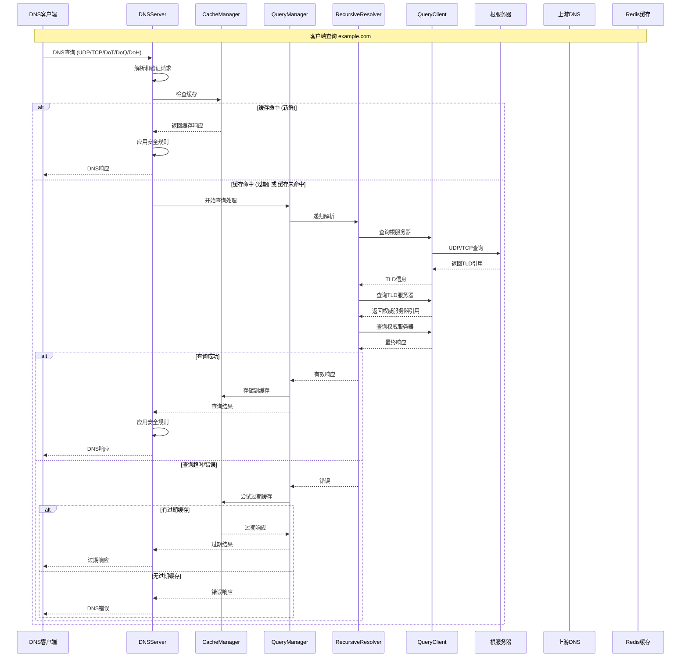

# ZJDNS Server

🚀 高性能递归 DNS 解析服务器，基于 Go 语言开发，支持 Redis 缓存、DNSSEC 验证、ECS、DoT/DoQ/DoH 等高级功能。

> ⚠️ **警告**
> 本项目为 Vibe Coding 产物，代码结构复杂且未经充分生产环境验证，请勿用于生产环境。

---

## ✨ 功能特点

### 🔧 核心功能

- **递归 DNS 解析**：完整实现 DNS 递归查询算法，从根服务器开始逐级解析
- **智能根服务器管理**：自动管理 13 个 IPv4 和 13 个 IPv6 根服务器，基于实时网络延迟测试进行动态排序，优先选择最优服务器进行查询
- **智能协议协商**：同时支持 UDP 和 TCP 协议，**当 UDP 响应被截断或超过缓冲区大小时，自动回退到 TCP 协议**，确保大响应数据的完整传输
- **CNAME 链解析**：智能处理 CNAME 记录链，防止循环引用，支持多级 CNAME 解析
- **并发查询**：高性能并发处理，支持连接池管理
- **DNS 重写功能**：支持精确匹配的域名重写规则，可实现域名过滤和重定向；支持自定义响应码（如 NXDOMAIN、SERVFAIL 等）和 DNS 记录（如 A、AAAA、CNAME 等）的返回
- **混合模式**：可同时配置上游 DNS 服务器和递归解析器，实现灵活的查询策略
- **网络质量感知排序**：对解析结果进行网络延迟测试并按质量排序，优先返回网络质量最佳的结果

### 🛡️ 安全与防御特性

- **CIDR 过滤**：基于 CIDR 规则的智能 IP 地址过滤功能，支持精确的结果控制。
  - **文件配置**：通过外部文件定义 CIDR 规则，支持动态加载和管理。
  - **标签匹配**：使用标签系统关联上游服务器与过滤规则，实现灵活的策略配置。
  - **记录过滤**：智能过滤 A 和 AAAA 记录，仅允许符合 CIDR 规则的 IP 结果通过。
  - **拒绝策略**：当任何记录被过滤时，返回 REFUSED 响应，确保严格的访问控制。
- **DNS 劫持预防**：主动检测并智能应对来自根服务器的越权响应。
  - **第一步**：当检测到根服务器直接返回非根域名的最终记录时，判定为 DNS 劫持。
  - **第二步**：**自动切换到 TCP 协议进行重试**，以绕过常见的 UDP 污染。
  - **第三步**：如果 TCP 查询结果**依然**被劫持，则彻底拒绝该响应，从源头上防止污染。
- **DNSSEC 验证**：完整的 DNSSEC 支持和验证，可设置服务器强制验证，支持 AD 标志传递
- **ECS 支持**：EDNS Client Subnet，提供地理位置感知的解析，支持 `auto`、`auto_v4`、`auto_v6` 自动检测或手动 CIDR 配置
- **递归深度保护**：防止恶意递归查询攻击，可配置最大递归深度

### 🔐 安全传输协议

- **DNS over TLS (DoT)**：支持标准的 DNS over TLS 协议 (RFC 7818)，在端口 `853` 上提供加密的 DNS 查询，防止中间人窃听和篡改。
- **DNS over QUIC (DoQ)**：支持前沿的 DNS over QUIC 协议，利用 QUIC 协议的 0-RTT、多路复用和连接迁移等特性，提供更低延迟和更高可靠性的加密 DNS 服务。
- **DNS over HTTPS (DoH/DoH3)**：同时支持 HTTP/2 和 HTTP/3 的 DoH 服务，在端口 `443` 上提供基于 HTTPS 的 DNS 查询。
- **统一证书管理**：DoT、DoQ 和 DoH 共享同一套 TLS 证书配置，简化部署。
- **自签名 CA 支持**：内置自签名 CA 功能，可为域名动态签发 TLS 证书，简化开发环境配置。
- **调试证书自动生成**：在开发或调试模式下，自动生成自签名 TLS 证书，无需外部证书文件。
- **增强 TLS 日志**：提供详细的 TLS 握手和证书验证日志，便于问题诊断和安全监控。

### 🔧 TLS 证书管理

- **自签名根 CA**：内置自签名根证书颁发机构，支持为任意域名签发 TLS 证书。
- **动态证书签发**：可根据配置的域名动态生成有效的 TLS 证书，无需外部证书文件。
- **开发调试支持**：在开发环境中自动生成临时证书，简化配置流程。
- **EC 密钥支持**：支持 ECDSA 私钥的生成、序列化和加载，提供更现代的加密算法。
- **证书验证日志**：详细的 TLS 证书验证过程日志，包括证书链验证、有效期检查等。

### 📦 DNS Padding

- **RFC 7830 标准支持**：实现 DNS Padding 功能，通过在 EDNS0 中添加填充字节，使 DNS 响应数据包大小标准化，有效对抗基于流量大小的指纹识别和审查。
- **智能块大小填充**：填充至推荐的 468 字节，平衡隐私保护和带宽效率。
- **按需启用**：可通过配置文件灵活开启或关闭此功能，**仅对安全连接（DoT/DoQ/DoH）生效**。

### 📍 DDR (Discovery of Designated Resolvers) 功能

- **自动发现支持**：支持 RFC [9461](https://www.rfc-editor.org/rfc/rfc9461.html)/[9462](https://www.rfc-editor.org/rfc/rfc9462.html) DNS SVCB 记录，用于自动发现安全 DNS 服务器
- **SVCB 记录生成**：自动生成 DoT、DoH、DoQ 的 SVCB 记录，支持 IPv4 和 IPv6 提示
- **灵活配置**：通过配置文件指定 DDR 域名和对应的 IP 地址，支持 IPv4 和 IPv6 双栈配置
- **智能响应**：当收到 `_dns.resolver.arpa`、`_dns.dns.example.org`、`_non_53_port._dns.dns.example.org` 的 SVCB 查询时，自动返回配置的加密 DNS 服务信息

### 🚀 网络质量测试 (SpeedTest)

- **多协议支持**：支持 ICMP、TCP 和 UDP 等多种协议进行网络质量测试
- **灵活配置**：可配置不同的测试端口和超时时间，适应不同网络环境
- **智能排序**：根据测试结果对 DNS 解析结果进行延迟排序，优先返回网络质量最佳的结果
- **缓存机制**：内置测试结果缓存，避免重复测试，提高响应速度
- **并发处理**：支持并发测试多个 IP 地址，提高测试效率

### 💾 缓存系统

- **双模式运行**：
  - **无缓存模式**：适合测试环境，零配置启动，纯递归解析
  - **Redis 缓存模式**：生产环境推荐，支持分布式部署，数据持久化
- **智能 TTL 管理**：灵活的 TTL 策略，支持最小/最大 TTL 限制
- **过期缓存服务 (Serve Stale)**：在上游服务器不可用时，提供过期缓存服务，极大提高系统可用性
- **预取机制**：后台自动刷新即将过期的缓存，减少用户等待时间
- **ECS 感知缓存**：基于客户端地理位置（EDNS Client Subnet）的缓存分区，提供精准的本地化解析
- **访问节流**：对缓存的访问时间更新操作进行节流，减轻 Redis 压力

### 🕵️ 请求追踪系统

- **全链路追踪**：为每个 DNS 请求生成唯一 ID，详细记录处理过程中的每一步操作和耗时。
- **智能日志**：在 `DEBUG` 级别下，输出带时间戳的请求处理步骤，极大简化调试和性能分析。
- **摘要报告**：在 `INFO` 级别下，输出请求处理摘要，包括缓存命中状态、总耗时、使用的上游服务器等关键信息。

### 🧠 内存管理与优化

- **工作池任务管理**：优化的 TaskManager 采用固定工作池和任务队列，防止 goroutine 爆炸，减少内存开销。
- **智能消息池化**：增强的 DNS 消息池，支持大小限制（1000 条消息）、slice 容量控制（50），以及适当的清理机制，防止内存膨胀。
- **受控查询并发**：限制并发查询数量（MaxSingleQuery: 5），采用首胜策略，减少资源使用并提高响应时间。
- **实时内存监控**：每 30 秒持续跟踪内存使用情况，当内存超过 500MB 时自动触发垃圾回收。
- **资源生命周期管理**：在关闭过程中正确清理所有资源，防止内存泄漏。
- **Goroutine 优化**：在关键路径上直接使用 goroutine 而非 TaskManager，减少上下文切换开销。

---

## 🏗️ 系统架构

ZJDNS 采用模块化、分层设计，核心组件职责清晰、松耦合，支持高并发与多种安全协议。架构强调内存效率和资源优化，具备智能任务管理和实时监控功能。整体架构如下：

```mermaid
graph TB
    subgraph "客户端层"
        A[DNS Client<br><i>客户端设备</i>]
    end

    subgraph "核心服务层"
        B[DNSServer<br><i>服务器核心</i>]
        C[ConfigManager<br><i>配置管理</i>]
        E[CacheManager<br><i>缓存接口</i>]
        F[QueryManager<br><i>查询管理器</i>]
        G[UpstreamHandler<br><i>上游处理器</i>]
    end

    subgraph "协议处理层"
        H[UDPServer<br><i>UDP:53</i>]
        I[TCPServer<br><i>TCP:53</i>]
        J[DoTHandler<br><i>DoT:853</i>]
        K[DoQHandler<br><i>DoQ:784/8853</i>]
        L[DoHHandler<br><i>DoH:443</i>]
    end

    subgraph "DNS处理引擎"
        M[RecursiveResolver<br><i>递归解析器</i>]
        N[CNAMEHandler<br><i>CNAME处理器</i>]
        O[ResponseValidator<br><i>响应验证器</i>]
        P[QueryClient<br><i>查询客户端</i>]
    end

    subgraph "安全与增强层"
        Q[SecurityManager<br><i>安全管理器</i>]
        R[EDNSManager<br><i>EDNS管理器</i>]
        S[DNSSECValidator<br><i>DNSSEC验证</i>]
        T[HijackPrevention<br><i>劫持防护</i>]
        U[CIDRManager<br><i>CIDR过滤</i>]
        V[RewriteManager<br><i>DNS重写</i>]
        W[SpeedTestManager<br><i>网络测试</i>]
    end

    subgraph "缓存系统"
        X[RedisCache<br><i>Redis缓存</i>]
        Y[NullCache<br><i>无缓存模式</i>]
        Z[预取机制<br><i>Cache Prefetch</i>]
        AA[ServeStale<br><i>过期缓存服务</i>]
    end

    subgraph "基础设施层"
        BB[RequestTracker<br><i>请求追踪</i>]
        DD[TLSManager<br><i>TLS证书管理</i>]
        EE[RootServerManager<br><i>根服务器管理</i>]
        FF[IPDetector<br><i>IP检测器</i>]
        GG[LogManager<br><i>日志管理</i>]
        LL[ConnPool<br><i>连接池</i>]
    end

    subgraph "外部服务"
        KK[Root Servers<br><i>根服务器</i>]
        MM[Upstream DNS<br><i>上游DNS</i>]
        NN[Redis Cluster<br><i>Redis集群</i>]
        OO[Self-signed CA<br><i>自签名CA</i>]
        PP[TLS Certificates<br><i>TLS证书</i>]
    end

    %% 主要连接关系
    A -->|DNS查询| H
    A -->|DNS查询| I
    A -->|安全查询| J
    A -->|安全查询| K
    A -->|安全查询| L

    H --> B
    I --> B
    J --> B
    K --> B
    L --> B

    B --> M
    B --> N
    B --> O
    B --> P

    M --> Q
    M --> R
    M --> S
    M --> T
    M --> U
    M --> V
    M --> W

    P --> EE
    P --> LL
    B --> X
    B --> Y
    X --> Z
    X --> AA

    B --> BB
    B --> DD
    B --> FF
    B --> GG

    %% 外部连接
    EE --> KK
    G --> MM
    X --> NN
    DD --> OO
    DD --> PP
    J --> PP
    K --> PP
    L --> PP

    %% 样式定义
    classDef client fill:#3498db,stroke:#2980b9,color:#fff
    classDef core fill:#2ecc71,stroke:#27ae60,color:#fff,font-weight:bold
    classDef protocol fill:#e67e22,stroke:#d35400,color:#fff
    classDef engine fill:#9b59b6,stroke:#8e44ad,color:#fff
    classDef security fill:#e74c3c,stroke:#c0392b,color:#fff
    classDef cache fill:#f39c12,stroke:#d68910,color:#fff
    classDef infra fill:#34495e,stroke:#2c3e50,color:#fff
    classDef external fill:#95a5a6,stroke:#7f8c8d,color:#fff

    class A client
    class B,C,E,F,G core
    class H,I,J,K,L protocol
    class M,N,O,P engine
    class Q,R,S,T,U,V,W security
    class X,Y,Z,AA cache
    class BB,DD,EE,FF,GG,LL infra
    class KK,MM,NN,OO,PP external
```



---

## 🔍 DNS 查询过程

### 完整查询流程

以下图表和步骤详细说明了 DNS 查询如何在 ZJDNS 中从客户端请求到最终响应的完整流程：



---

## 📋 使用示例

### 生成示例配置文件

```bash
./zjdns -generate-config > config.json
```

### 启动服务器

```bash
# 使用默认配置（纯递归模式，无缓存）
./zjdns

# 使用配置文件启动（推荐）
./zjdns -config config.json
```

---

## 📝 许可证

本项目采用 MIT 许可证，详见 [LICENSE](LICENSE) 文件。

---

## 🛠️ 开发工具

### golangci-lint

在提交代码前，请使用 [golangci-lint](https://golangci-lint.run/) 进行代码检查。

安装 golangci-lint：

```bash
brew install golangci-lint
```

运行检查 & 代码格式化：

```bash
golangci-lint run & golangci-lint fmt
```

提交代码前请确保 golangci-lint 检查通过，以保证代码质量和一致性。

---

## 🙏 致谢

感谢以下开源项目：

- [miekg/dns](https://github.com/miekg/dns) - Go DNS 库
- [redis/go-redis](https://github.com/redis/go-redis) - Redis Go 客户端
- [quic-go/quic-go](https://github.com/quic-go/quic-go) - QUIC 协议实现
