# ZJDNS 架构流程图

> 本文件与代码逐条核对（2026-08），所有流程图描述的实现细节（常量、分支、门条件）均可回溯到源码。
> 约定：`Zone`/`DNS64` 中间件为条件挂载（有规则/配置时才在链上）。

## 目录

- [整体架构](#整体架构)
- [服务生命周期](#服务生命周期)
- [缓存持久化](#缓存持久化)
- [中间件管道](#中间件管道)
- [MQTYPE (RFC 10029)](#mqtype-rfc-10029)
- [缓存查询流程](#缓存查询流程)
- [递归解析流程](#递归解析流程)
- [Fallback 上游延迟采纳](#fallback-上游延迟采纳)
- [DNSSEC 验证链](#dnssec-验证链)
- [EDNS 处理流程](#edns-处理流程)
- [DNS 污染检测（防御机制）](#dns-污染检测防御机制)
- [TC→TCP 自动回退](#tctcp-自动回退)
- [Zone 规则评估](#zone-规则评估)
- [Singleflight 查询去重](#singleflight-查询去重)
- [DNS64 合成](#dns64-合成)
- [规则集引擎](#规则集引擎)
- [延迟探测](#延迟探测)
- [连接池与协议协商](#连接池与协议协商)
- [SOCKS5 代理路径](#socks5-代理路径)
- [共享端口协议复用（demux）](#共享端口协议复用demux)
- [协议对照：标准加密 ↔ 国密](#协议对照标准加密-国密)
- [DNSCrypt 密钥管理](#dnscrypt-密钥管理)
- [DNSCrypt 加密流程](#dnscrypt-加密流程)
- [同步统计记录](#同步统计记录)

## 整体架构

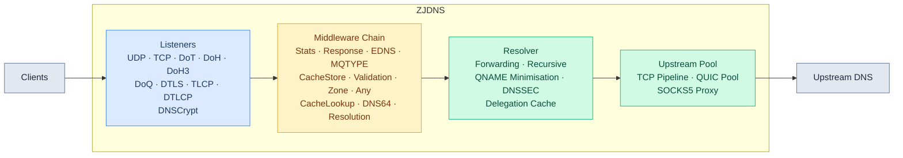

## 服务生命周期

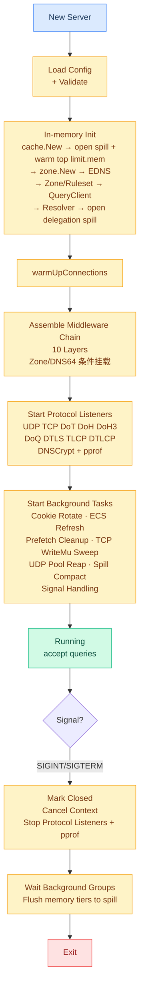

> 后台任务共 7 项（`server/tasks.go`）：Cookie 密钥轮换（24h）、ECS 公网 IP 刷新（15min）、
> prefetch 节流清理、TCP writeMu 分片注册表 sweep（5min）、UDP 连接池死连接回收、
> spill 压实（5min）、信号处理。统计**不是**后台任务——同步内存计数（见「同步统计记录」）。

## 缓存持久化

三个 store（cache / latency / delegation）在配置 `state_file` 时启用磁盘
第二层（`internal/spillfile` append-log）：内存淘汰的未过期条目落盘，内存
miss 时读盘提升，关机时内存全量 flush，5 分钟周期压实（丢弃过期与超
`limit.disk` 的条目，temp+rename 原子重写）。启动时最热的 `limit.mem`
条载入内存，其余留盘。默认路径为空 = 不持久化（重启冷启动）。DNSCrypt
证书状态独立持久化（`dnscryptstate`）。

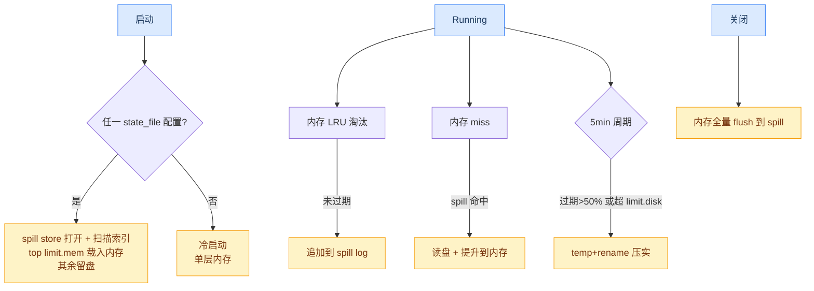

## 中间件管道

```mermaid
graph LR
    Q[Query] --> ST[Stats<br/>qctx.Result 分类<br/>唯一 journal 记录点]
    ST --> R[Response<br/>EDNS · Cookie · EDE<br/>Pre-packed fast path]
    R --> E[EDNS<br/>Parse-then-Validate · ECS<br/>Cookie · Padding]
    E --> MQ[MQTYPE<br/>RFC 10029 合并 · FORMERR<br/>所有模式]
    MQ --> CS[CacheStore<br/>Miss 响应构建 · Cache 写<br/>延迟探测]
    CS --> V[Validation<br/>Domain · Label · Type<br/>Opcode · QCLASS · NXNAME/XFR]
    V --> Z[Zone<br/>Rules · Wildcard<br/>Bypass · Loopback Gate]
    Z --> A[Any<br/>RFC 8482 HINFO]
    A --> CL[CacheLookup<br/>Fresh → Serve<br/>Stale → Refresh]
    CL --> D64[DNS64<br/>AAAA Synthesis]
    D64 --> RE[Resolution<br/>Upstream · Recursive<br/>Singleflight]
    classDef mw fill:#fef3c7,stroke:#f59e0b,color:#78350f
    class Q mw
    class ST,R,E,MQ,CS,V,Z,A,CL,D64,RE mw
```

> 执行顺序（外层→内层）：`Stats → Response → EDNS → MQTYPE → CacheStore → Validation →
> Zone → Any → CacheLookup → DNS64 → Resolution`（`middleware/chain.go`）。`Zone` 仅当配置了
> zone 规则、`DNS64` 仅当配置了 DNS64 时挂载。`MQTYPE` 位于 CacheStore 外侧（post 阶段在
> CacheStore 构建主响应之后合并）、EDNS 内侧（pre 阶段可见已解析的 Pseudo 选项）。各层通过
> 设置 `qctx.Result` 分类结果，由最外层 `Stats` 统一记录请求日志（`internal/stats.Journal`）。

### MQTYPE (RFC 10029)

**出站（ZJDNS 作为 MQTYPE 客户端）**：

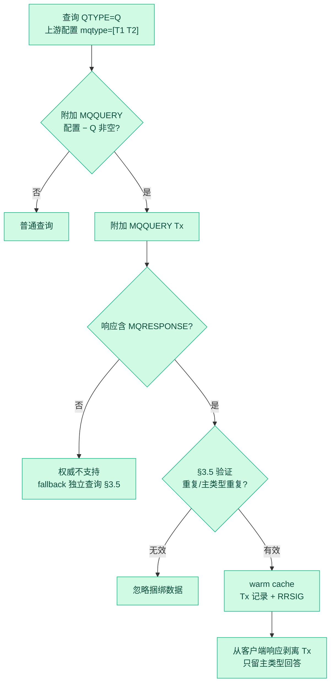

**入站（ZJDNS 作为 MQTYPE 服务端）**：

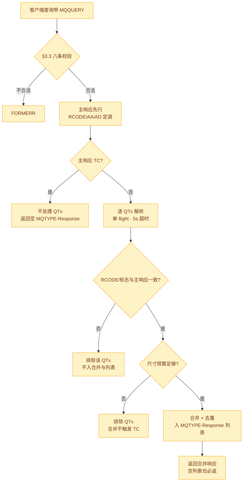

> 配置：`upstream[*].mqtype`（数字 QTYPE 列表，如 `[1, 28]`；加载期校验：data type、
> 非元类型、去重、≤4 个 §4 QTx cap）。forward 与 `protocol: recursive` 均适用。
> 不实现：zonecut DS+NS 合并（RFC A.3 记录的失败场景）、NS walk 串行化短路。

**出站失败无选项重试（§3.5，forward.go / nameserver.go 双路径）**：

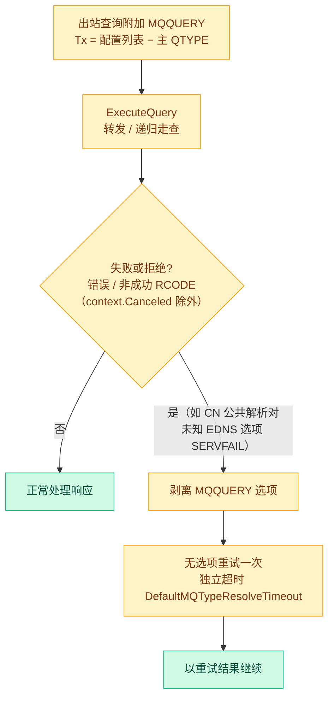

### 缓存命中直发（pre-packed）

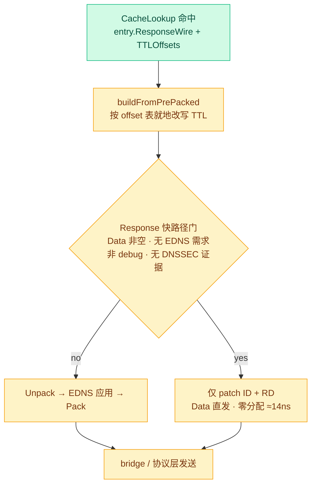

> 门条件（`middleware/response.go`）：`!shouldAddEDNS && !IsDebug && !qctx.ResHasDNSSEC`
>（`ResHasDNSSEC` 是 `Entry.HasDNSSEC` 的镜像标志，buildCacheResponse 时置位——免逐次扫描 wire）。
> zone 合成的响应 `Data == nil`，天然不走该路径，无需显式门判断。

### TCP 写入分片（16 shard 注册表）

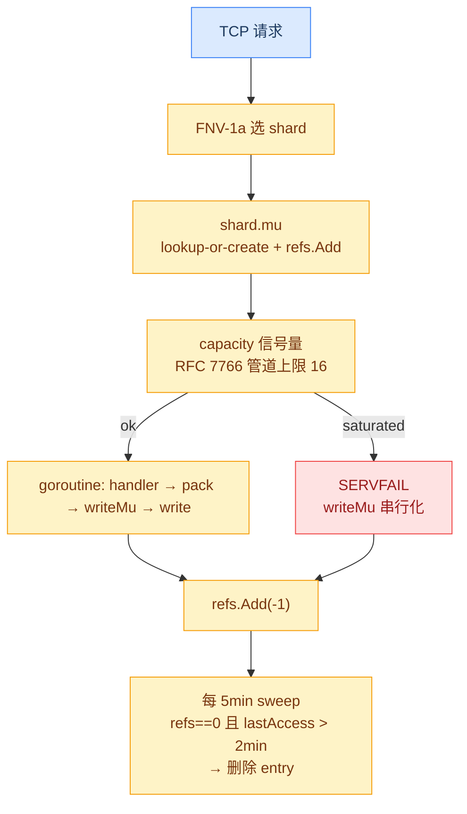

### UDP 响应截断（RFC 9715 R3）

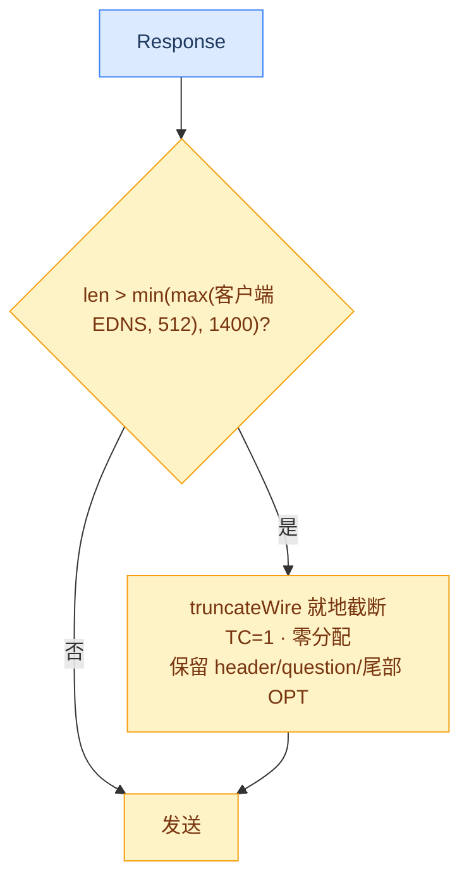

## 缓存查询流程

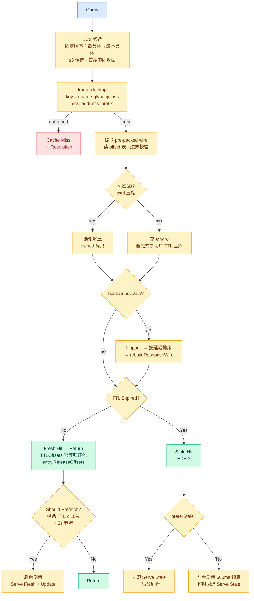

> ECS 候选 = 精确前缀 + 固定 fallback 链（IPv4 /24→/16→/8→/0，IPv6 /56→/48→/32→/0），
> 第一个命中即返回（等价于旧 SQL `max(ecs_prefix)`）。命中路径无 Unpack/Pack 往返。

## 递归解析流程

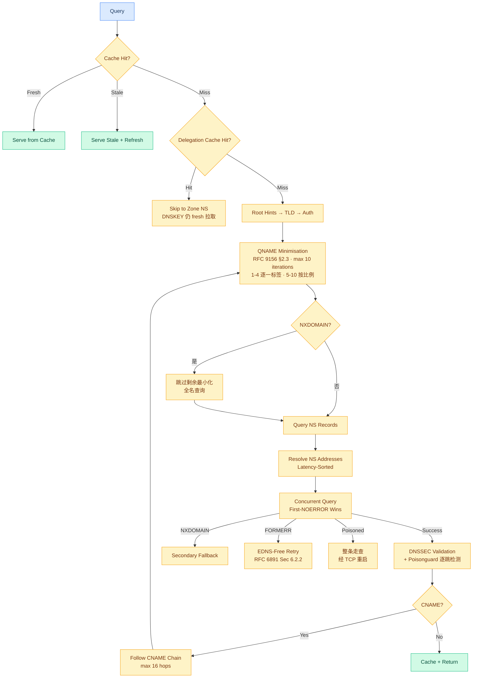

> CNAME 链超过 16 hops 时返回已收集的部分链并告警（非 SERVFAIL）。委派缓存命中只替换
> 起始 NS 集，后续每跳仍过完整 Poisonguard 探测。

### 权威并发扇出（first-6 + 75ms 扩宽）

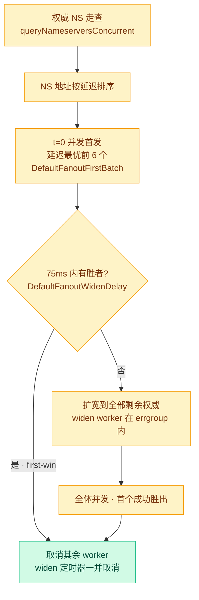

## Fallback 上游延迟采纳

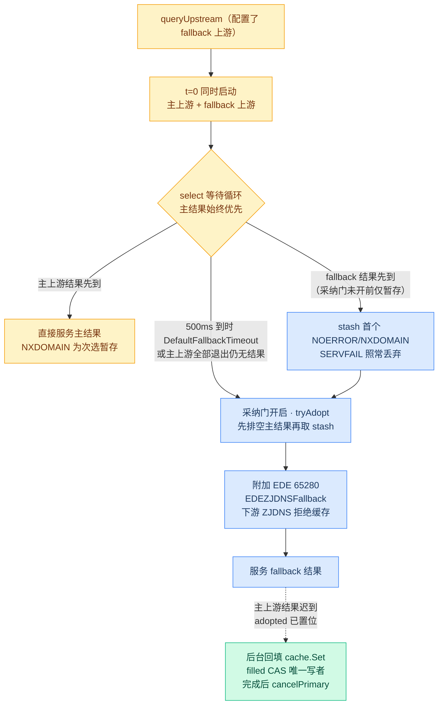

> fallback 结果的采纳门（`server/resolver/forward_fallback.go`）：500ms
> `DefaultFallbackTimeout` 内主结果始终胜出；主上游全部退出仍无结果时提前开门
> （`primariesDoneCh`）。被采纳的响应携带 EDE 65280，下游 ZJDNS 实例拒绝缓存；
> 迟到的主结果经 `maybeBackfill` 镜像 CacheStore 门条件后台写入缓存。

## DNSSEC 验证链

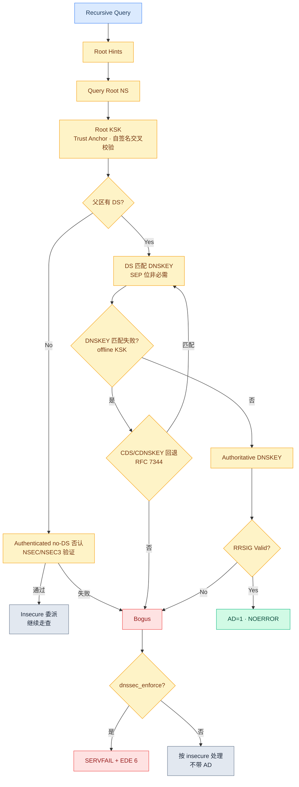

> 委派无 DS 时走**验证过的 no-DS 否认**（NSEC/NSEC3）判定 insecure，而不是直接 bogus；
> CDS/CDNSKEY（RFC 7344）仅在 DS→DNSKEY 匹配失败（离线 KSK 部署）时尝试。
> Bogus → SERVFAIL 仅当 `dnssec_enforce` 开启。

## EDNS 处理流程

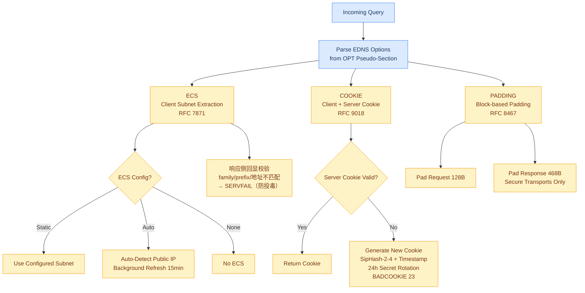

> Cookie 生命周期（RFC 9018 §4.3）：Server Cookie 有效期 1h、续期阈值 30min、未来容忍 5min；
> MAC 计算 IPv4 4 字节 / IPv6 16 字节，Reserved 字节计入 hash（防地址族替换攻击）。

## DNS 污染检测（防御机制）

所有防御机制均配置在 `UpstreamServer` 上，同时支持转发和递归模式（递归模式
由 `protocol: "recursive"` 上游的 guard 标志传播）。

### 上行查询路径（转发 + 递归通用）

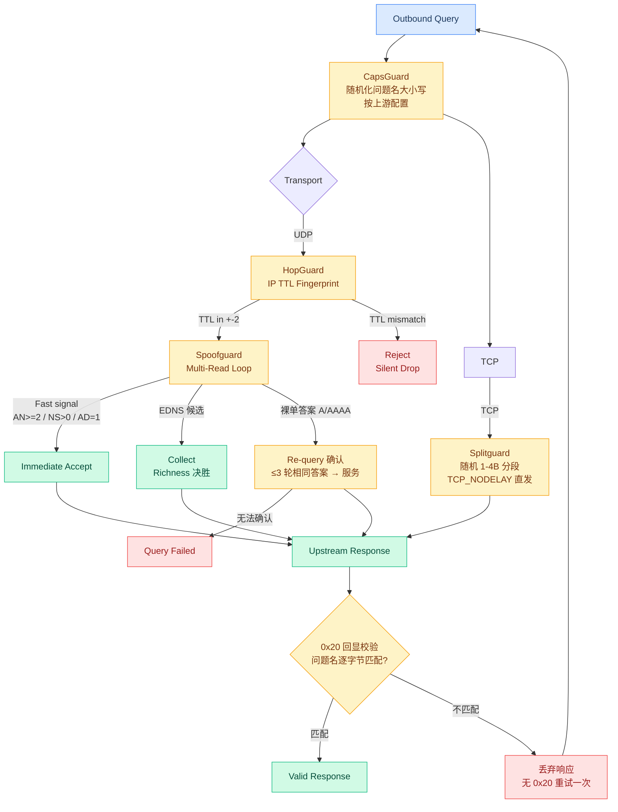

### 递归逐跳检测（Poisonguard 专属）

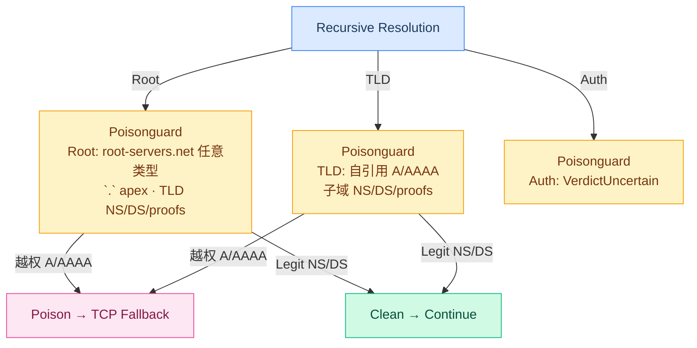

### 防御机制

| 层 | 机制 | 适用模式 | 作用层 | 检测原理 |
|---|------|----------|--------|----------|
| 1 | **HopGuard** | 转发+递归 | IP 层 | UDP 上游 TTL 指纹学习，32 样本武装，拒绝偏离 ±2 的响应 |
| 2 | **SpoofGuard** | 转发+递归 | DNS 报文层 | UDP 多读循环（自适应窗口：单包 150ms / 多包 500ms，同内容重复即确认），fast signal 即收、EDNS 候选决胜、裸单答案重查确认 |
| 3 | **SplitGuard** | 转发+递归 | TCP 流层 | TCP 分段发送（随机 [1,4] 字节），破坏 DPI 首包特征识别 |
| 4 | **Poisonguard** | 递归专属 | DNS 内容层 | 每跳 zone-authority 交叉验证，检测越权 A/AAAA 注入 |
| 5 | **CapsGuard** | 转发+递归（按上游） | 事务 ID 层 | 出站问题名 ASCII 字母大小写随机化（每字母 +1 bit 熵），应答须逐字节回显；不匹配 → 丢弃 + 无 0x20 重试一次；同一上游累计 8 次失配 → 10 分钟内跳过随机化（避免逐查询双倍出站）（draft-vixie-dnsext-dns0x20 §5.5/§6.4） |

### 防御机制详解

#### CapsGuard（DNS 0x20，按上游配置）

出站查询在 `ExecuteQuery` 中随机化问题名每个 ASCII 字母的 0x20 bit
（`server/defense/capsguard.go` `RandomizeCase`），应答必须逐字节回显问题名
（RFC 4343 §3 大小写不敏感仅限 ASCII）。回显不匹配视为伪造或坏中间盒：
丢弃响应、以原始大小写重试一次（安全性 = 未启用 CapsGuard 的基线），不
匹配 Warn 日志按 `config.DefaultCapsGuardWarnEvery` 采样。同一上游地址累计
`DefaultCapsGuardDowngradeAfter`（8）次失配后，该地址在
`DefaultCapsGuardRetryAfter`（10 分钟）内直接跳过随机化——回显伪造者否则
能让每次查询都付出双倍出站流量；回显校验、spoofguard collect、question
匹配仍然全部生效。入站侧
（`server/handler/response.go` `patchQuestionCase`）在缓存命中响应中把
存储的 canonical 问题名原地恢复为客户端原始大小写（0x20 翻转不改变 wire
长度，TTL 偏移不受影响）。

#### HopGuard（IP TTL 指纹）

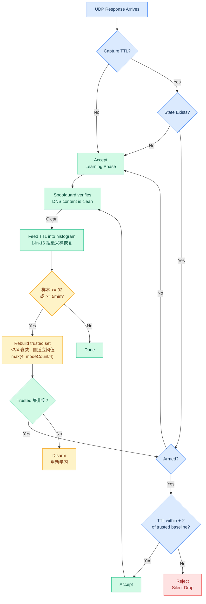

> 状态存于 256 容量的 LRU（按上游键）。Windows/无 IP TTL 平台自动降级（放行 + 警告）；
> SOCKS5 代理路径无 TTL 元数据，HopGuard 自动禁用。

#### SpoofGuard（UDP 多读 + 门控）

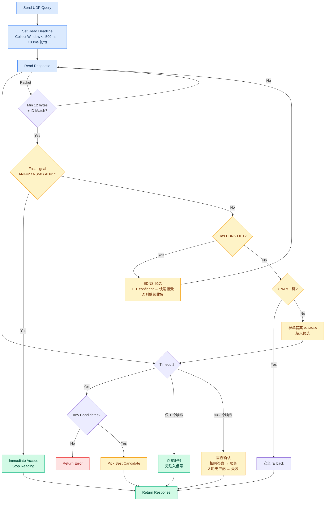

> 无 EDNS 的裸单答案 A/AAAA 不再直接拒绝——收集为歧义候选，仅 1 个响应时直接服务，
> ≥2 个响应（注入信号）时重查确认（`DefaultSpoofguardConfirmRounds = 3`）。EDNS 响应是
> 合法候选（GFW 裸响应无 EDNS）。决胜：EDNS 优先 → answer 数多者胜 → 随机 tie-break。

#### SplitGuard（TCP 分段发送）

```mermaid
graph LR
    Q[DNS over TCP Query] --> PACK[Pack DNS Message<br/>2-byte Length Prefix + Body]
    PACK --> RAND[每段随机大小 1-4B]
    RAND --> LOOP{Loop until<br/>all bytes sent}
    LOOP -->|remaining > seg| SEND[Write 随机长度段]
    SEND --> LOOP
    LOOP -->|last chunk| LAST[Write remaining bytes]
    LAST --> WAIT[Await Response]
    classDef io fill:#dbeafe,stroke:#3b82f6,color:#1e3a5f
    classDef proc fill:#fef3c7,stroke:#f59e0b,color:#78350f
    class Q,WAIT io
    class PACK,RAND,LOOP,SEND,LAST proc
```

> 首段含 2 字节长度前缀；`TCP_NODELAY` 关闭 Nagle 保证小段立发。无时间抖动——DPI 对抗
> 靠段大小随机性（每段独立 [1, segSize=4]），TCP 重组对服务器透明。

#### Poisonguard（递归 Zone-Authority 交叉验证）

```mermaid
graph TD
    Q[Recursive Response<br/>from Delegation Hop] --> EXTRACT[Extract Answer RRs<br/>matching query name]
    EXTRACT --> SIG{RRSIG 匹配存在?}
    SIG -->|Yes| CLEAN[VerdictClean<br/>DNSSEC 签名不可伪造]
    SIG -->|No| CLASSIFY[classify zone name rrtype]
    CLASSIFY --> ROOT{zone == .?}
    ROOT -->|Yes| CR[classifyRoot]
    CR --> ISROOT{name is<br/>root-servers.net?<br/>或 apex .}
    ISROOT -->|Yes| CLEAN
    ISROOT -->|No| ISTLD{NS/DS/proofs<br/>and name is TLD?}
    ISTLD -->|Yes| CLEAN
    ISTLD -->|No| POISON[VerdictPoisoned]
    ROOT -->|No| TLD{isTLD zone?}
    TLD -->|Yes| CT[classifyTLD]
    CT --> SAME{name == zone?<br/>自引用}
    SAME -->|Yes| CLEAN
    SAME -->|No| SUBDEL{子域 NS/DS/proofs?}
    SUBDEL -->|Yes| CLEAN
    SUBDEL -->|No| POISON
    TLD -->|No| UNCERTAIN[VerdictUncertain<br/>Authoritative: cannot<br/>distinguish by content alone]
    POISON --> TCPFALL[TLD probe 或检测<br/>→ 当前层 TCP<br/>poisonSeen → CNAME 后续也 TCP]
    CLEAN --> CONTINUE[Continue Resolution]
    UNCERTAIN --> CONTINUE
    classDef clean fill:#d1fae5,stroke:#10b981,color:#064e3b
    classDef poison fill:#fce7f3,stroke:#ec4899,color:#831843
    classDef uncertain fill:#fef3c7,stroke:#f59e0b,color:#78350f
    classDef proc fill:#dbeafe,stroke:#3b82f6,color:#1e3a5f
    class CLEAN,CONTINUE clean
    class POISON,TCPFALL poison
    class UNCERTAIN uncertain
    class Q,EXTRACT,SIG,CLASSIFY,ROOT,CR,ISROOT,ISTLD,TLD,CT,SAME,SUBDEL proc
```

> TLD probe：完整 qname（RD=0, UDP）发给 TLD server（1s 超时），返回 A/AAAA 即判中毒。
> 委派缓存命中非 TLD zone 时跳过 probe（无 tldServers）；命中 TLD zone 时 probe 仍执行。
> proofs = RRSIG/NSEC/NSEC3。

## TC→TCP 自动回退

```mermaid
graph TD
    Q[Outbound Query] --> TYPE{Protocol}
    TYPE -->|Plain UDP| UDPEXEC[UDP Exchange]
    UDPEXEC --> UDPCHECK{TC=1 or Error?}
    UDPCHECK -->|No| DONEP[Return]
    UDPCHECK -->|Yes| PLAINTCP[Plain TCP Retry<br/>same server + proxy]
    TYPE -->|DTLS| DTLS[DTLS Exchange<br/>incl. SOCKS5 proxy]
    DTLS --> DTLSCK{Failed?}
    DTLSCK -->|No| DONED[Return]
    DTLSCK -->|Yes| DOTFALL[DoT Fallback<br/>same server + proxy]
    TYPE -->|DTLCP| DTLCPEX[DTLCP Exchange<br/>incl. SOCKS5 proxy]
    DTLCPEX --> DTLCPCK{Failed?}
    DTLCPCK -->|No| DONEL[Return]
    DTLCPCK -->|Yes| TLCPFALL[TLCP Fallback<br/>same server + proxy]
    TYPE -->|DNSCrypt UDP| DCRYPT[DNSCrypt UDP<br/>incl. SOCKS5 proxy]
    DCRYPT --> DCCK{TC=1 or Error?}
    DCCK -->|No| DONEC[Return]
    DCCK -->|Yes| DCTCP[DNSCrypt TCP Retry<br/>same server + proxy]
    TYPE -->|Recursive<br/>Poisonguard| POISON[Poisonguard detects<br/>Injected A/AAAA]
    POISON --> RECTCP[TCP Fallback<br/>bypass GFW via encrypted TCP]
    classDef start fill:#dbeafe,stroke:#3b82f6,color:#1e3a5f
    classDef ok fill:#d1fae5,stroke:#10b981,color:#064e3b
    classDef fallback fill:#fef3c7,stroke:#f59e0b,color:#78350f
    classDef poison fill:#fce7f3,stroke:#ec4899,color:#831843
    class Q start
    class DONEP,DONED,DONEL,DONEC ok
    class PLAINTCP,DOTFALL,TLCPFALL,DCTCP fallback
    class RECTCP poison
```

## Zone 规则评估

```mermaid
graph TD
    Q[Query] --> BYPASS{Bypass Rules<br/>Match?}
    BYPASS -->|Yes| NEXT[Skip Zone -> Next]
    BYPASS -->|No| EVAL[Evaluate<br/>qname + qtype + qclass<br/>+ client tags + client IP]
    EVAL -->|No Match| NOMATCH[No Match -> Next]
    EVAL -->|Match| DESTRUCT{破坏性 CHAOS 端点?<br/>zjdns.*.clear}
    DESTRUCT -->|是且非回环| REFUSE[REFUSED<br/>SECURITY 日志]
    DESTRUCT -->|否/回环| RCODE{Rcode == 0?}
    RCODE -->|非 0| BLOCK[构建 RCODE 响应<br/>NXDOMAIN/SERVFAIL/REFUSED…<br/>+ EDE 4]
    RCODE -->|0| RECORDS{含 Answer/Authority<br/>/Additional 记录?}
    RECORDS -->|No| PASSTHROUGH[纯透传<br/>不重写 QNAME]
    RECORDS -->|Yes| SYNTH[构建合成响应<br/>AA=1 · TTL 扣除<br/>通配符 owner 改写<br/>RFC 1034 §4.3.3]
    BLOCK --> SHORTCUT[Short-circuit Pipeline<br/>qctx.Res = synthetic]
    SYNTH --> SHORTCUT
    classDef start fill:#dbeafe,stroke:#3b82f6,color:#1e3a5f
    classDef proc fill:#fef3c7,stroke:#f59e0b,color:#78350f
    classDef match fill:#d1fae5,stroke:#10b981,color:#064e3b
    classDef nomatch fill:#e2e8f0,stroke:#64748b,color:#1e293b
    class Q start
    class BYPASS,EVAL,DESTRUCT,REFUSE,RCODE,BLOCK,RECORDS,SYNTH proc
    class SHORTCUT match
    class NOMATCH,NEXT,PASSTHROUGH nomatch
```

> 无记录规则（Rcode=0 且无 RR）为**纯透传**——旧的 QNAME 重写分支是死代码，已移除。
> 破坏性 CHAOS 端点（`zjdns.cache.clear` 等）仅限回环地址。

## Singleflight 查询去重

```mermaid
graph TD
    Q[Concurrent Identical Queries] --> JOIN[Build PendingKey<br/>qname+qtype+qclass<br/>+ecs_addr+ecs_prefix<br/>+dnssec_ok]
    JOIN --> LRU[LRU Map 10000 entries<br/>LoadOrStore key->pendingCall]
    LRU -->|First Caller<br/>Leader| EXEC[Execute Upstream Query]
    LRU -->|Subsequent<br/>Follower| WAIT[Wait on done channel<br/>with 60s timeout]
    EXEC --> RESULT[Get Result]
    RESULT --> CLONE[Deep Clone RRs<br/>Answer+Authority+Additional]
    CLONE --> DONE[Store result<br/>Close done channel]
    DONE --> RETL[Return to Leader]
    WAIT -->|Leader finishes| SHARED[Receive Shared Result]
    WAIT -->|Timeout 60s| TIMEOUT[Return Timeout Error<br/>→ SERVFAIL]
    SHARED --> RETF[Return to Follower]
    LRU -->|Eviction| EVICT[OnEvict: ErrEvicted<br/>+ close done channel<br/>→ SERVFAIL for waiters]
    classDef start fill:#dbeafe,stroke:#3b82f6,color:#1e3a5f
    classDef leader fill:#d1fae5,stroke:#10b981,color:#064e3b
    classDef follower fill:#fef3c7,stroke:#f59e0b,color:#78350f
    classDef err fill:#fee2e2,stroke:#ef4444,color:#991b1b
    class Q,JOIN start
    class EXEC,RESULT,CLONE,DONE,RETL leader
    class LRU,WAIT,SHARED,RETF follower
    class TIMEOUT,EVICT err
```

## DNS64 合成

```mermaid
graph TD
    Q[AAAA Query] --> RESOLVE[Resolve AAAA]
    RESOLVE --> HASAAAA{Has AAAA?}
    HASAAAA -->|Yes| RETAAAA[Return AAAA]
    HASAAAA -->|No| RESA[二次 A 查询<br/>先查响应缓存<br/>+ singleflight 去重]
    RESA --> HASA{Has A?}
    HASA -->|No| RETNO[Return Empty]
    HASA -->|Yes| SYNTH[Embed IPv4 into<br/>NAT64 Prefix<br/>RFC 6052 Sec 2.2]
    SYNTH --> TTL["TTL 上限 min(A, SOA, 600s)<br/>合成 AAAA 不带 AD"]
    TTL --> RETSYNTH[Return Synthetic AAAA]
    classDef start fill:#dbeafe,stroke:#3b82f6,color:#1e3a5f
    classDef proc fill:#fef3c7,stroke:#f59e0b,color:#78350f
    classDef out fill:#d1fae5,stroke:#10b981,color:#064e3b
    class Q start
    class RESOLVE,RESA,SYNTH,TTL proc
    class RETAAAA,RETSYNTH,RETNO out
```

> 前缀 `64:ff9b::/96`（well-known），支持 /32,/40,/48,/56,/64,/96 嵌入布局（RFC 6052 Figure 1）。

## 规则集引擎

```mermaid
graph LR
    subgraph Load
        CFG[Config Rules] --> DOM[Domain Rules<br/>TLD+1 Suffix]
        CFG --> IP[IP CIDR Rules<br/>Binary Radix Trie]
    end
    subgraph Match
        Q[Query] --> DOMQ[Domain Lookup<br/>in-memory suffix map]
        Q --> IPQ[IP Lookup<br/>O-128 Trie Walk]
        DOMQ --> TAGS[Collect Tags]
        IPQ --> TAGS
    end
    TAGS --> USE{Usage}
    USE -->|Upstream| ROUTE[Route to Matching Server]
    USE -->|Zone| FILTER[Filter Zone Rules<br/>by Client Tags]
    classDef start fill:#dbeafe,stroke:#3b82f6,color:#1e3a5f
    classDef proc fill:#fef3c7,stroke:#f59e0b,color:#78350f
    classDef out fill:#d1fae5,stroke:#10b981,color:#064e3b
    class CFG,Q start
    class DOM,IP,DOMQ,IPQ,TAGS,USE proc
    class ROUTE,FILTER out
```

## 延迟探测

```mermaid
graph TD
    QUERY[Cache Hit<br/>with A/AAAA Records] --> EXTRACT[Extract All IPs<br/>from Answer Section<br/>跳过 loopback/private/link-local]
    EXTRACT --> BATCH[Batch lookup<br/>in-memory latency map]
    BATCH -->|All Cached| SORT[Sort Records<br/>by Latency ASC]
    BATCH -->|Some Missing| PROBE[Background Probe<br/>per-IP concurrent]

    PROBE --> STEPS[按配置顺序执行探测步骤<br/>首个成功即返回<br/>elapsed from start]
    STEPS --> ICMP[ICMP Ping<br/>privileged raw socket]
    STEPS --> TCP[TCP Connect<br/>configurable port]
    STEPS --> UDP[UDP Send + Read<br/>single-byte datagram]
    STEPS --> HTTP[HTTP HEAD<br/>port 80]
    STEPS --> HTTPS[HTTPS HEAD<br/>port 443 · TLS]
    STEPS --> HTTP3[HTTP3 HEAD<br/>port 443 · QUIC]
    STEPS --> DNS[DNS Query<br/>UDP:53 · ID match]
    STEPS --> DNSTCP[DNS Query<br/>TCP:53 · length-prefixed]

    ICMP --> SUCC{任一成功?}
    TCP --> SUCC
    UDP --> SUCC
    HTTP --> SUCC
    HTTPS --> SUCC
    HTTP3 --> SUCC
    DNS --> SUCC
    DNSTCP --> SUCC
    SUCC -->|是| LAT[取首个成功步骤耗时]
    SUCC -->|否| MAX[MaxInt64<br/>视为不可达]
    LAT --> SMOOTH[EWMA 平滑<br/>无偏整数 EWMA · α=1/2<br/>首次探测直接存储]
    SMOOTH --> STORE[Store latency map<br/>Per-IP, shared across domains]
    MAX --> STORE
    STORE --> SORT
    SMOOTH -.->|下一轮探测<br/>≥60s 后（min interval）| PROBE

    SORT --> RETURN[Return Sorted Answer<br/>Fastest IP First]
    classDef start fill:#dbeafe,stroke:#3b82f6,color:#1e3a5f
    classDef proc fill:#fef3c7,stroke:#f59e0b,color:#78350f
    classDef proto fill:#d1fae5,stroke:#10b981,color:#064e3b
    classDef out fill:#e2e8f0,stroke:#64748b,color:#1e293b
    class QUERY start
    class EXTRACT,BATCH,PROBE,STEPS,SUCC,LAT,MAX,SMOOTH,STORE,SORT proc
    class ICMP,TCP,UDP,DNS,DNSTCP,HTTP,HTTPS,HTTP3 proto
    class RETURN out
```

> 聚合语义：按配置顺序执行各探测步骤，**首个成功步骤的累计耗时**即该 IP 的延迟
> （不是各步骤最小值）。缓存命中时 `sortAnswerByLatency` 按延迟升序重排 A/AAAA。
>
> **NS/Root 探测**（`ProbeNSAddrs`）：固定两步 `dns:53 → dns-tcp:53`，不读配置。
> 发送真实 DNS 查询（root A），任意响应（NOERROR/NXDOMAIN/REFUSED/SERVFAIL）即成功，
> 按 RFC 5452 §4.2 校验 QR 位与消息 ID。**无 ping 步骤**——链式首胜下多数公共 NS
> 的 ICMP 响应会短路真实 DNS 测量。
>
> **SRTT 平滑**（`UpdateLatency`）：写入前用无偏整数 EWMA 合并历史值
> `srtt = ((N-1)·srtt + rtt) / N`，`DefaultLatencyProbeSmoothFactor = 2`（α=1/2）——
> 抗单点抖动，链式首胜的瞬时 RTT 不再直接污染排序。首次探测 / 过期条目（3 天）直接
> 存储；探测失败不写，保留旧平滑值。

## 连接池与协议协商

```mermaid
graph LR
    subgraph Client
        Q[Query] --> ROUTE{Route}
        ROUTE -->|UDP| SPOOF{SpoofGuard?}
        SPOOF -->|Yes| MULTI[Multi-Read<br/>EDNS Gate + Richness]
        SPOOF -->|No| UDP[UDP Exchange]
        ROUTE -->|TCP| POOL[TCP Connection Pool<br/>RFC 7766 Pipelining]
        POOL -->|SplitGuard| SEG[Segmented Write<br/>1-4 byte chunks]
        POOL -->|Normal| TCP[TCP Exchange]
        ROUTE -->|TLS| DOT[DoT Pool<br/>TLS 1.3 · 0-RTT · Session Resume]
        ROUTE -->|QUIC| DOQ[DoQ Pool<br/>0-RTT · Address Validation]
        ROUTE -->|HTTPS| DOH[DoH<br/>HTTP/2 · TLS 1.3]
        ROUTE -->|HTTP3| DOH3[DoH3<br/>HTTP/3 · QUIC]
        ROUTE -->|DTLS| DTLS[DTLS<br/>DTLS 1.3 · PMTU Truncate]
        ROUTE -->|DNSCrypt| DCRYPT[DNSCrypt<br/>X-Wing PQ · XChaCha20]
        ROUTE -->|TLCP| TLCP[TLCP DoT<br/>SM2/SM3/SM4 · Session Cache]
        ROUTE -->|HTTP-TLCP| TLCPDOH[TLCP DoH<br/>SM2/SM3/SM4 · HTTP/2]
        ROUTE -->|DTLCP| DTLCP[DTLCP<br/>SM2/SM3/SM4 · PMTU Truncate]
    end
    MULTI --> UP[Upstream]
    UDP --> UP
    SEG --> UP
    TCP --> UP
    DOT --> UP
    DOQ --> UP
    DOH --> UP
    DOH3 --> UP
    DTLS --> UP
    DCRYPT --> UP
    TLCP --> UP
    TLCPDOH --> UP
    DTLCP --> UP
    classDef query fill:#dbeafe,stroke:#3b82f6,color:#1e3a5f
    classDef route fill:#fef3c7,stroke:#f59e0b,color:#78350f
    classDef proto fill:#d1fae5,stroke:#10b981,color:#064e3b
    classDef gm fill:#f3e8ff,stroke:#a855f7,color:#4c1d95
    classDef ext fill:#e2e8f0,stroke:#64748b,color:#1e293b
    class Q query
    class ROUTE,SPOOF route
    class MULTI,UDP,POOL,SEG,TCP,DOT,DOQ,DOH,DOH3,DTLS,DCRYPT proto
    class TLCP,TLCPDOH,DTLCP gm
    class UP ext
```

> 四种池类型（`server/upstream/pool/`）：TCP/DoT/DTLS/TLCP/DTLCP 走
> **ConnPool**、UDP/DNSCrypt-UDP 走 **UDPPool**、DNSCrypt-TCP 走 **RawPool**
> （长度前缀帧复用，不解析 DNS，nonce 前缀路由）、DoQ 走 **QUIC 连接池**、
> DoH/DoH3/HTTP-TLCP 走 HTTP transport 缓存。
>
> **统一三层上限**（每池实例）：per-key 8 连接 × per-conn 16 在途 × **全局 512
> live 连接**（`DefaultMaxPoolTotalConns`）。超限时 `dialAndAdd` 触发
> `evictOne` 驱逐：死连接 → 空闲 LRU → 任意 LRU（`lastUsed` 时间戳，close
> 在锁外）。空闲回收 UDP 30s / TCP 60s。服务端并发上限统一派生自
> `DefaultServerGoroutineLimit`（256），QUIC 连接准入 128。

## SOCKS5 代理路径

```mermaid
graph LR
    Q[Query] --> PROXY{Proxy?}
    PROXY -->|No| POOL[Pooled Direct<br/>key=addr]
    PROXY -->|Yes| POOLP["Pooled Proxied<br/>key=addr|proxy"]
    POOLP -->|TCP family| TCPR[Relay TCP<br/>Socks Handshake<br/>一次/连接]
    POOLP -->|UDP family| UDPR[UDP ASSOCIATE<br/>relay 绑定<br/>一次/socket]
    POOL --> UP[Upstream]
    TCPR --> UP
    UDPR --> UP
    classDef query fill:#dbeafe,stroke:#3b82f6,color:#1e3a5f
    classDef proc fill:#fef3c7,stroke:#f59e0b,color:#78350f
    classDef ext fill:#e2e8f0,stroke:#64748b,color:#1e293b
    class Q query
    class PROXY,POOL,POOLP,TCPR,UDPR proc
    class UP ext
```

> 全部 12 协议客户端支持 SOCKS5：代理连接与直连共用池机制，key 含代理
> 标识（`addr|proxy`），dialFunc 建立 SOCKS5 ASSOCIATE/TCP relay —— 握手
> 每 socket 一次而非每查询。证书获取（UDP+TCP）同样走代理池化。裸拨号
> 仅保留为池不可用时的回退。**guard 兼容性**：spoofguard/splitguard/
> poisonguard 完全支持（内容/TCP 层机制与传输无关；poisonguard 经
> `recursiveProxyURL` 走递归代理链）；hopguard 降级（SOCKS5 relay 不带 IP
> TTL 元数据，警告 + 无 TTL 模式，由 spoofguard 兜底内容防护）。

## 共享端口协议复用（demux）

```mermaid
graph TD
    subgraph TCPSHARE["共享 TCP 端口（如 20853 DoT+TLCP-DoT / 20443 DoH+TLCP-DoH+DNSCrypt）"]
        TC["TCP 接入"] --> SNIFF["internal/demux DetectTCPProtocol<br/>读 5 字节记录头 · 10s 读超时<br/>bufferedConn 回放已读字节"]
        SNIFF -->|"版本字节 0x03"| TLS["TLS 服务器<br/>DoT / DoH"]
        SNIFF -->|"版本字节 0x01"| TLCP["TLCP 服务器<br/>TLCP-DoT / TLCP-DoH"]
        SNIFF -->|"其他首字节"| DCT["DNSCrypt TCP"]
    end
    subgraph UDPSHARE["共享 UDP 端口（如 20853 DoQ+DTLS+DTLCP / 20443 DoH3+DNSCrypt）"]
        DG["UDP 首个数据报"] --> PLAIN{"明文 DNS 查询形状?<br/>QR=0 · QD=1 · AN=NS=0"}
        PLAIN -->|"是（明文证书获取等）"| FALL["DNSCrypt 回退"]
        PLAIN -->|否| QUIC{"首字节 >= 0xC0<br/>且长度 >= 1200?"}
        QUIC -->|"是"| Q["QUIC<br/>DoQ / DoH3"]
        QUIC -->|否| DTLS{"首字节 0x14-0x18<br/>版本 0xFEFF/0xFEFD/0xFEFC?"}
        DTLS -->|"是"| D["DTLS"]
        DTLS -->|否| DTLCP{"版本 0x0101?"}
        DTLCP -->|"是"| DL["DTLCP"]
        DTLCP -->|否| FALL
    end
    TLS --> DISPATCH
    TLCP --> DISPATCH
    DCT --> DISPATCH
    Q --> DISPATCH
    D --> DISPATCH
    DL --> DISPATCH
    FALL --> DISPATCH["server/protocol/shared 分发<br/>UDP: addrKey 零分配键 · PacketBufPool 池化缓冲<br/>peerProto 按客户端缓存（≤65536）<br/>60s 空闲回收"]
    classDef io fill:#dbeafe,stroke:#3b82f6,color:#1e3a5f
    classDef proc fill:#fef3c7,stroke:#f59e0b,color:#78350f
    classDef proto fill:#d1fae5,stroke:#10b981,color:#064e3b
    class TC,DG io
    class SNIFF,PLAIN,QUIC,DTLS,DTLCP,DISPATCH proc
    class TLS,TLCP,DCT,Q,D,DL,FALL proto
```

> 检测刻意保守（错误阳性会从 DNSCrypt 回退偷走数据报——其明文证书获取首字节近乎随机）：
> 明文 DNS 查询形状最先判定并落到底层回退；QUIC Initial 恒 ≥1200 字节（RFC 9000 §14），
> 长度下限排除与明文 DNS 的随机 ID 碰撞。检测结果按客户端地址缓存（`peerProto`）。
>
> 每客户端队列与饱和语义（2026-09 修复后）：DNSCrypt/DTLCP 队列 256 包（替代 dedicated
> 监听器本有的内核 socket 缓冲）、worker 信号量 64；饱和时在客户端自己的 drain 协程
> **内联处理**（对齐 dedicated 的 handleSaturated，绝不丢包、绝不阻塞分发循环），丢弃
> 带原子计数 + 采样 Warn。实测与 dedicated 端口 QPS/延迟/尾部持平。

## 协议对照：标准加密 ↔ 国密

```mermaid
graph TD
    subgraph Standard[标准加密体系]
        TLS[TLS 1.3<br/>ECDSA + AES-GCM + SHA-256] -->|TCP 加密| DOT[DoT RFC 7858]
        TLS -->|TCP + HTTP| DOH[DoH RFC 8484]
        TLS -->|UDP 适配| DTLS[DTLS 1.2/1.3 RFC 8094]
        DTLS -->|UDP 加密| DOD[DoD DNS over DTLS]
    end
    subgraph GM[国密体系 GB/T 38636 · GM/T 0128]
        TLCP[TLCP<br/>SM2 + SM4-GCM + SM3] -->|TCP 加密| TLCPDOT[TLCP DoT]
        TLCP -->|TCP + HTTP| TLCPDOH[TLCP DoH]
        TLCP -->|UDP 适配| DTLCP[DTLCP GM/T 0128]
        DTLCP -->|UDP 加密| DTLCPDOD[DTLCP DoD]
    end

    TLS -.->|加密原语替换<br/>ECDSA→SM2<br/>AES-GCM→SM4-GCM<br/>SHA-256→SM3| TLCP
    DTLS -.->|加密原语替换<br/>DTLS→DTLCP| DTLCP

    classDef std fill:#dbeafe,stroke:#3b82f6,color:#1e3a5f
    classDef gm fill:#f3e8ff,stroke:#a855f7,color:#4c1d95
    classDef proto fill:#d1fae5,stroke:#10b981,color:#064e3b
    class TLS,DTLS std
    class TLCP,DTLCP gm
    class DOT,DOH,DOD,TLCPDOT,TLCPDOH,DTLCPDOD proto
```

## DNSCrypt 密钥管理

```mermaid
graph TD
    START[Server Start] --> GEN[Generate Initial Cert Pair<br/>Classical + PQ<br/>Ed25519 Signing Key]
    GEN --> TICKET["Derive Ticket Key<br/>SHA-256(DNSCrypt-PQ-ticket-key-v1 + signing key)<br/>从不轮换"]
    TICKET --> SERVE[Begin Serving]
    SERVE --> RENEW{8h Ticker}
    RENEW -->|fire| UPDATE[updateKeys<br/>铸造新证书对<br/>prepend newest first]
    UPDATE --> PURGE[Purge Expired Keys<br/>30s ticker<br/>仅按 NotAfter 判定<br/>无 overlap grace]
    PURGE --> RESETCACHE[Reset Shared Key Cache<br/>旧 X25519 密钥失效]
    RESETCACHE --> SERVE
    SERVE --> PERSIST[状态持久化<br/>dnscryptstate · 重启补铸<br/>config key 变更 → 丢弃状态]
    classDef start fill:#dbeafe,stroke:#3b82f6,color:#1e3a5f
    classDef proc fill:#fef3c7,stroke:#f59e0b,color:#78350f
    classDef ok fill:#d1fae5,stroke:#10b981,color:#064e3b
    class START start
    class GEN,TICKET,RENEW,UPDATE,PURGE,RESETCACHE,PERSIST proc
    class SERVE ok
```

> 证书 TTL 24h、轮换 ticker 8h（8h < 24h 自然形成当前+前一个的重叠窗口）。ticket key
> **不随证书轮换**（ticket 由客户端缓存，密钥漂移会使恢复失败）。

## DNSCrypt 加密流程

单一流程图覆盖三种会话模式（Classical / PQ 初始 / PQ 恢复），共享填充、加解密与响应路径：

```mermaid
graph TD
    C[Client] --> MODE{会话模式}
    MODE -->|Classical| GENKEY[Generate Ephemeral<br/>X25519 Key Pair<br/>或复用 cached key pair]
    MODE -->|PQ 初始| CERT[Fetch PQ Cert<br/>1320B via TXT query<br/>Ed25519 验签]
    MODE -->|PQ 恢复| RESUME[Build Resumed Query<br/>PQResumeMagic 8B<br/>Ticket + ClientNonce 12B]
    GENKEY --> CLQUERY[Build Query<br/>ClientMagic 8B<br/>ClientPk 32B<br/>ClientNonce 12B]
    GENKEY --> CLKEY[SharedKey = X25519<br/>ClientSk x ResolverPk]
    CERT --> ENCAP[X-Wing Encapsulate<br/>ResolverPk 1216B<br/>→ Ciphertext 1120B<br/>→ SharedSecret 32B]
    ENCAP --> HKDF[HKDF-SHA256 Derive<br/>cert-context + ciphertext]
    HKDF --> PQQUERY[Build PQ Query<br/>ClientMagic 8B<br/>Ciphertext 1120B<br/>ClientNonce 12B]
    CLQUERY --> PAD
    CLKEY --> PAD
    RESUME --> PAD
    PQQUERY --> PAD
    PAD["ISO/IEC 7816-4 Padding<br/>Classical: 目标 minQueryLen<br/>初始 512 · TC 翻倍 ≤4096<br/>EWMA 收缩 ≥512（均值低于预算一半时减半）<br/>PQ: 初始 ≥64B · 恢复 max(minQueryLen, 256)<br/>7 次重试后 TCP 回退"]
    PAD --> ENCRYPT[XChaCha20-Poly1305 Encrypt<br/>Nonce = ClientNonce + Zeroes 12B]
    ENCRYPT --> SEND[Send to Resolver]

    SEND --> SRECV[Resolver Receives]
    SRECV --> SMAGIC{ClientMagic<br/>Match Cert?}
    SMAGIC -->|No| REJECT[Silent Drop]
    SMAGIC -->|Yes| SDECRYPT{查询类型}
    SDECRYPT -->|Classical| SDH[Compute SharedKey<br/>X25519 ClientPk x ResolverSk<br/>SharedKeyCache 2048 LRU]
    SDECRYPT -->|PQ 初始| SDECAP[X-Wing Decapsulate<br/>Ciphertext x ResolverSk<br/>→ SharedSecret 32B]
    SDECRYPT -->|PQ 恢复| SOPEN[Open Ticket<br/>验证 cert-context<br/>Derive SharedKey]
    SDH --> SUNPAD[Decrypt + Verify<br/>+ Unpad]
    SDECAP --> SKDF[HKDF-SHA256 Derive<br/>SharedKey]
    SKDF --> SUNPAD
    SOPEN --> SUNPAD
    SUNPAD --> SPROCESS[Process DNS Query]

    SPROCESS --> SRESP[Build DNS Response]
    SRESP --> SPAD[Deterministic Padding<br/>SHA-256 SharedKey+ClientNonce<br/>Multiple of 64 bytes]
    SPAD --> SENCRYPT[Encrypt Response<br/>ResolverMagic 8B<br/>Nonce 24B + Poly1305 Tag]
    SENCRYPT --> SBUDGET{UDP Budget?}
    SBUDGET -->|OK| TICKET{Include<br/>Resumption Ticket?}
    SBUDGET -->|响应超预算| STRUNCATE[Truncate + Set TC]
    TICKET -->|Yes · 仅 PQ| BUILDCTL[Build Control Block<br/>PQDR Magic 4B + Version 1B<br/>TicketLifetime 4B + TicketLen 2B<br/>+ Sealed Ticket]
    BUILDCTL --> CTLBUDGET{票能装进<br/>预算?}
    CTLBUDGET -->|Yes| SSEND[Send to Client]
    CTLBUDGET -->|No| WITHHOLD[Withhold Ticket<br/>Send Response 无 TC]
    TICKET -->|No| SSEND

    SSEND --> CLIENT[PQ: Client Stores Ticket<br/>for Resumption · 600s 有效]
    CLIENT --> RESUME

    classDef client fill:#dbeafe,stroke:#3b82f6,color:#1e3a5f
    classDef server fill:#d1fae5,stroke:#10b981,color:#064e3b
    classDef ticket fill:#f3e8ff,stroke:#a855f7,color:#4c1d95
    classDef reject fill:#fee2e2,stroke:#ef4444,color:#991b1b
    class C,MODE,GENKEY,CLQUERY,CLKEY,CERT,ENCAP,HKDF,PQQUERY,RESUME,PAD,ENCRYPT,SEND,CLIENT client
    class SRECV,SMAGIC,SDECRYPT,SDH,SDECAP,SOPEN,SKDF,SUNPAD,SPROCESS,SRESP,SPAD,SENCRYPT,SBUDGET,SSEND server
    class TICKET,BUILDCTL,CTLBUDGET,WITHHOLD ticket
    class REJECT,STRUNCATE reject
```

> PQ ClientMagic = SHA-256(pq_public_key) 前 8 字节（首 7 字节全零或等于 PQResumeMagic 时
> 翻转首字节，避开 QUIC 首字节范围）。ticket 由 `ticketKey` 用 XChaCha20-Poly1305 密封，
> 明文 86B：resume-secret(32) + es-version(2) + client-magic(8) + serial(4) + ts-end(4) +
> expiry(4) + profile-ext-hash(32)。

### DNSCrypt 重放防护（服务端）

```mermaid
graph TD
    RECV["DNSCrypt UDP 查询到达"] --> RKEY["replayCache 查计数<br/>键 = client-magic + client-nonce/2<br/>+ client-pk 前缀"]
    RKEY --> RCNT{"10s 窗口内<br/>出现次数 <= 3?"}
    RCNT -->|"是（UDP 重传合法）"| DEC["进入正常解密流程"]
    RCNT -->|"否（同一密文重放）"| DROP["静默丢弃"]
    classDef io fill:#dbeafe,stroke:#3b82f6,color:#1e3a5f
    classDef ok fill:#d1fae5,stroke:#10b981,color:#064e3b
    classDef reject fill:#fee2e2,stroke:#ef4444,color:#991b1b
    class RECV,RKEY io
    class DEC ok
    class DROP reject
```

> 重放缓存（`server/protocol/dnscrypt/server.go`）：LRU 上限
> `DefaultDNSCryptReplayCacheSize`（8192）条，窗口
> `DefaultDNSCryptReplayWindow`（10s），超出 `DefaultDNSCryptReplayAllow`（3）
> 次的重复密文直接丢弃——UDP 重传合法，同一数据报洪泛不合法。

## 同步统计记录

```mermaid
graph LR
    REQ[Stats 中间件<br/>qctx.Result → RequestRecord] -->|同步 · 请求路径内| ATOMIC[原子计数器<br/>total · hit · miss<br/>rcode 计数]
    ATOMIC --> TOPK[非命中事件<br/>per-RCODE top-N 域名<br/>topk.Map 有界]
    TOPK --> DONE[Done<br/>无 channel · 无后台 goroutine<br/>重启归零]
    QUERY[zjdns.stats CHAOS] --> SNAP["读取内存快照<br/>O(1) 计数 + top-N 排序"]
    SNAP --> TXT[TXT 输出<br/>overview / hit / rcode / top-rcodeN]
    classDef io fill:#dbeafe,stroke:#3b82f6,color:#1e3a5f
    classDef proc fill:#fef3c7,stroke:#f59e0b,color:#78350f
    classDef done fill:#d1fae5,stroke:#10b981,color:#064e3b
    class REQ,QUERY io
    class ATOMIC,TOPK,SNAP,TXT proc
    class DONE done
```

> 统计为纯同步内存实现（`internal/stats/journal.go`）：原子计数器 + mutex 保护的 topk journal，
> 无缓冲 channel、无批量刷新、无过载丢弃。中间件只设置 `qctx.Result` 分类（hit/miss/stale/
> zone/any/badcookie/blocked/error），`Stats` 中间件（最外层）据此生成唯一的 RequestRecord。
> 清空端点 `zjdns.stats.clear` / `zjdns.querylog.clear` 仅限回环地址。
