# ZJDNS 架构流程图

## 整体架构

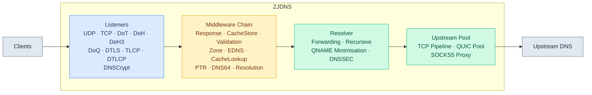

## 服务生命周期

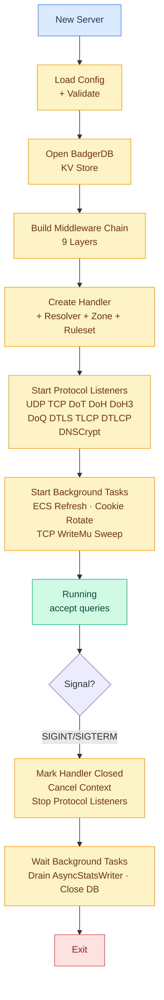

## 中间件管道

```mermaid
graph LR
    Q[Query] --> R[Response<br/>EDNS · Cookie · EDE]
    R --> CS[CacheStore<br/>Write · Request Log]
    CS --> V[Validation<br/>Domain · Label · Type<br/>Opcode · QCLASS]
    V --> Z[Zone<br/>Rules · Wildcard<br/>Bypass]
    Z --> E[EDNS<br/>ECS · Cookie<br/>Padding]
    E --> CL[CacheLookup<br/>Fresh → Serve<br/>Stale → Refresh]
    CL --> PT[PTR<br/>Reverse Lookup]
    PT --> D64[DNS64<br/>AAAA Synthesis]
    D64 --> RE[Resolution<br/>Upstream · Recursive<br/>Singleflight]
    classDef mw fill:#fef3c7,stroke:#f59e0b,color:#78350f
    class Q mw
    class R,CS,V,Z,E,CL,PT,D64,RE mw
```

## 缓存查询流程

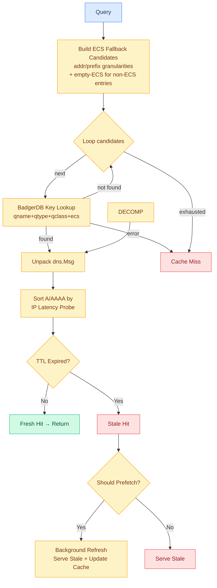

## 递归解析流程

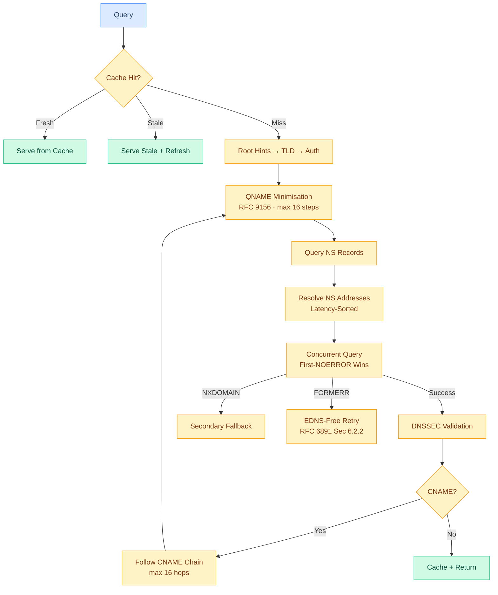

## DNSSEC 验证链

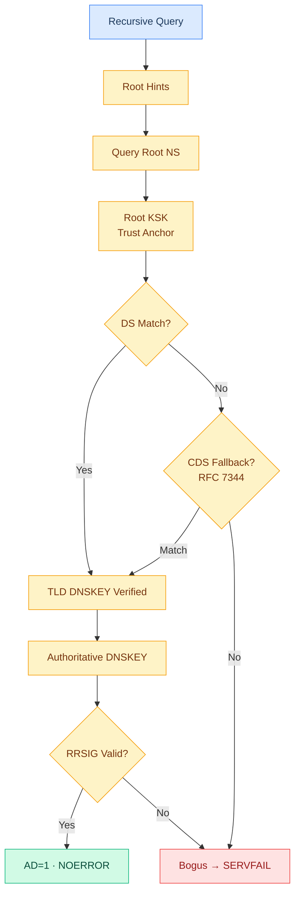

## EDNS 处理流程

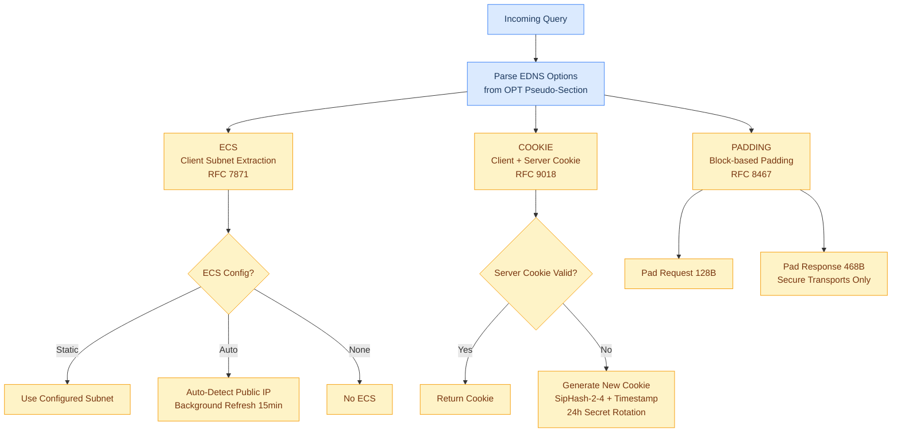

## DNS 污染检测（四层防御）

所有防御机制均配置在 `UpstreamServer` 上，同时支持转发和递归模式。

### 上行查询路径（转发 + 递归通用）

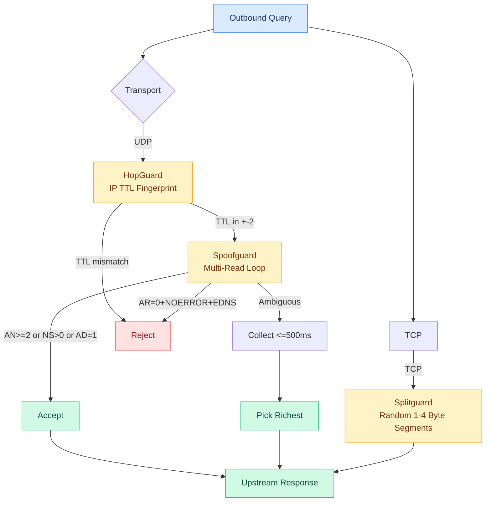

### 递归逐跳检测（Poisonguard 专属）

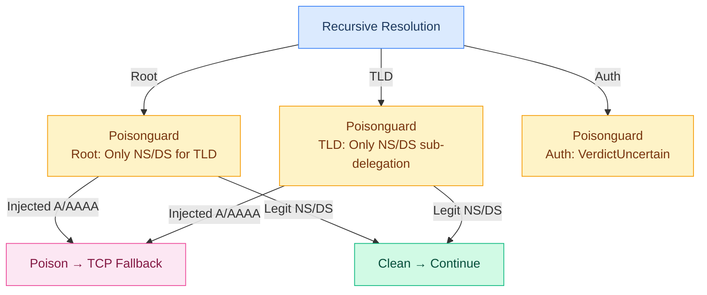

### 四层防御机制

| 层 | 机制 | 适用模式 | 作用层 | 检测原理 |
|---|------|----------|--------|----------|
| 1 | **HopGuard** | 转发+递归 | IP 层 | UDP 上游 TTL 指纹学习，32样本武装，拒绝偏离 +-2 的响应 |
| 2 | **SpoofGuard** | 转发+递归 | DNS 报文层 | UDP 多读循环，EDNS 门控 + richness 优选 |
| 3 | **SplitGuard** | 转发+递归 | TCP 流层 | TCP 分段发送（1-4字节），破坏 DPI 首包特征识别 |
| 4 | **Poisonguard** | 递归专属 | DNS 内容层 | 每跳 zone-authority 交叉验证，检测越权 A/AAAA 注入 |

### 防御机制详解

#### HopGuard（IP TTL 指纹）

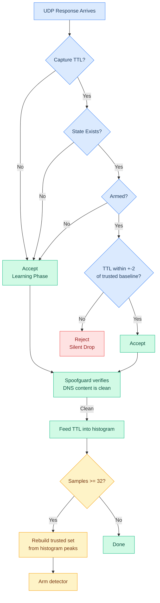

#### SpoofGuard（UDP 多读 + EDNS 门控）

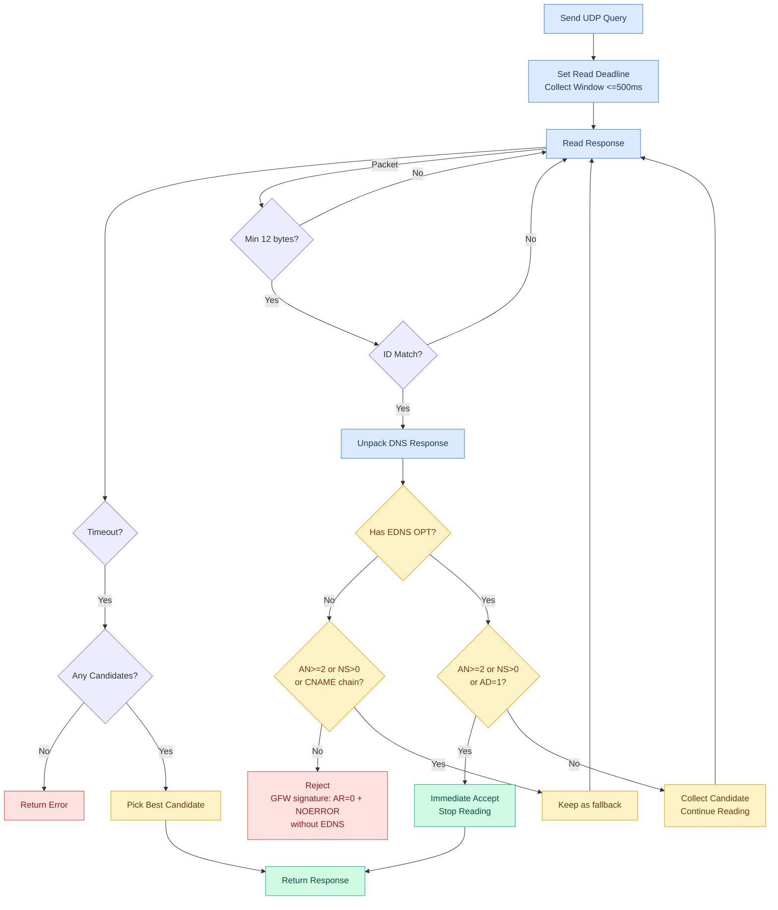

#### SplitGuard（TCP 分段发送）

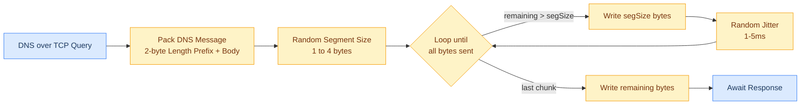

#### Poisonguard（递归 Zone-Authority 交叉验证）

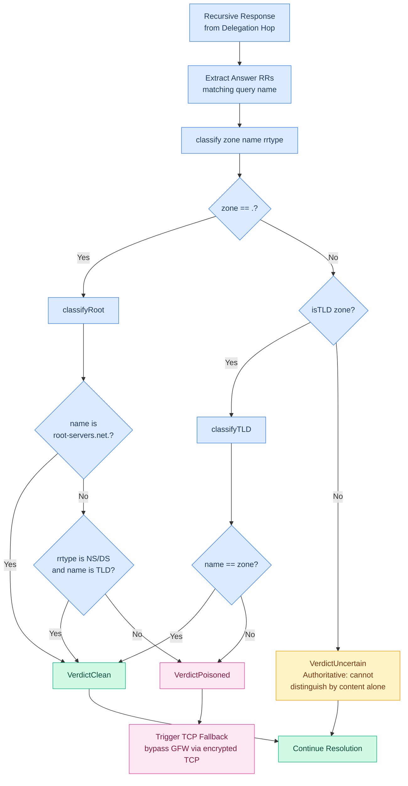

## TC→TCP 自动回退

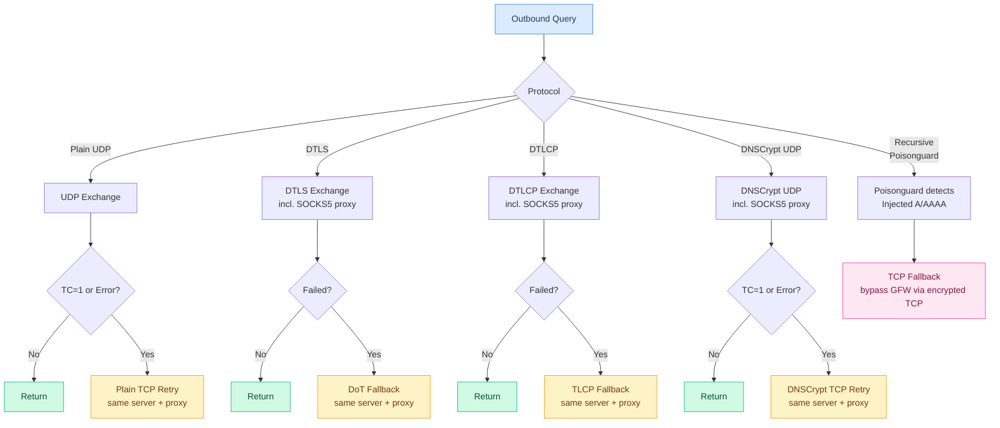

## Zone 规则评估

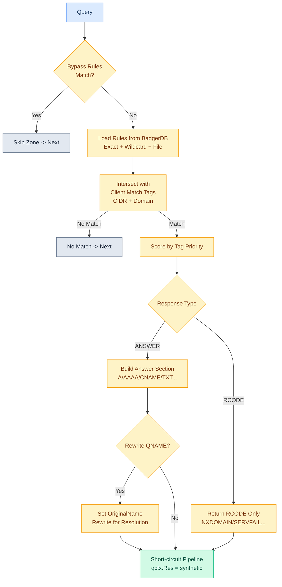

## Singleflight 查询去重

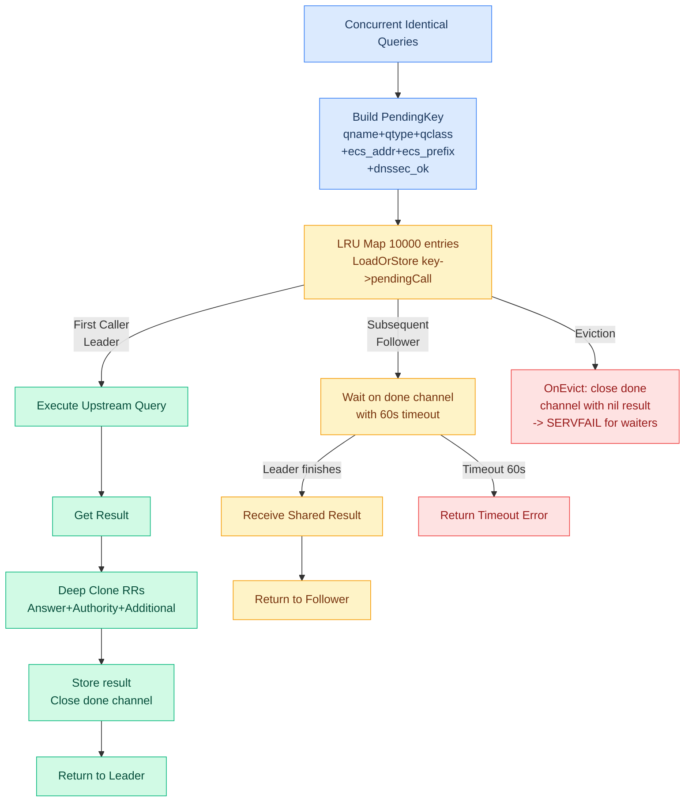

## DNS64 合成

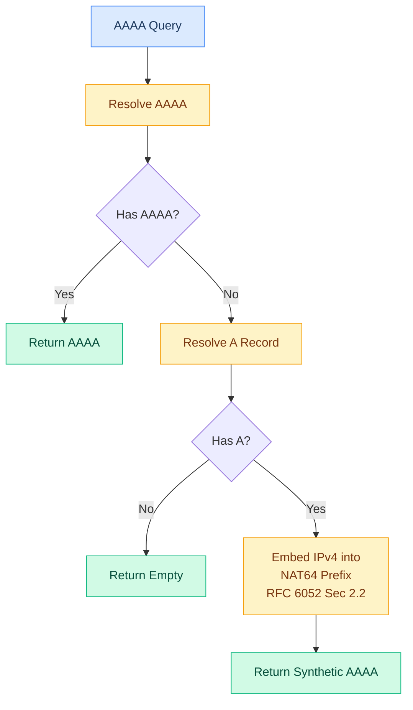

## 规则集引擎

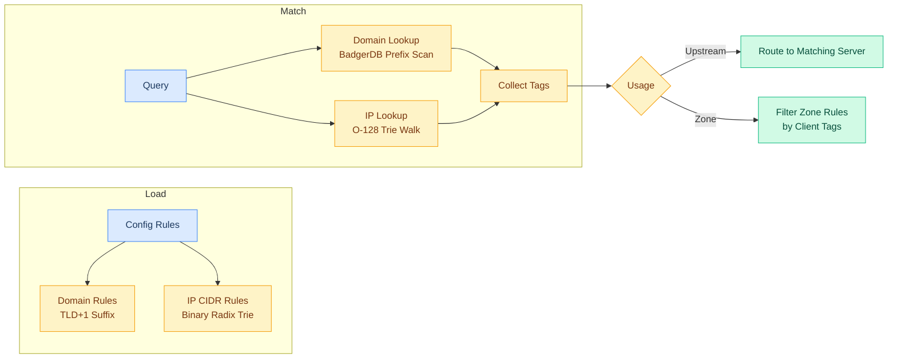

## 延迟探测

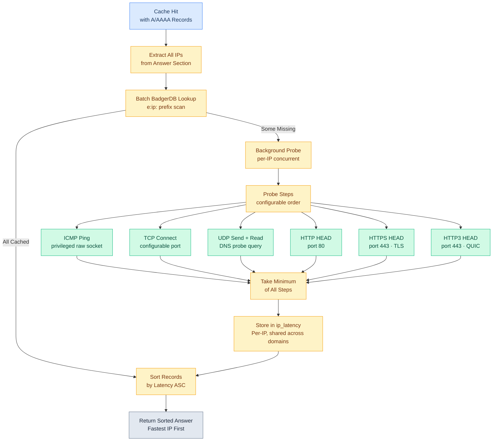

## 连接池与协议协商

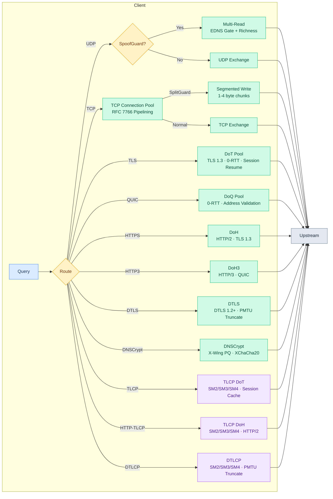

## SOCKS5 代理路径

```mermaid
graph LR
    Q[Query] --> PROXY{Proxy?}
    PROXY -->|No| DIRECT[Direct Dial]
    PROXY -->|Yes| AUTH{Auth?}
    AUTH -->|No| NOAUTH[TCP Connect<br/>+ UDP Associate]
    AUTH -->|User/Pass| UPAUTH[TCP Connect<br/>+ Auth Negotiation<br/>+ UDP Associate]
    NOAUTH --> UP[Upstream]
    UPAUTH --> UP
    DIRECT --> UP
    classDef query fill:#dbeafe,stroke:#3b82f6,color:#1e3a5f
    classDef proc fill:#fef3c7,stroke:#f59e0b,color:#78350f
    classDef ext fill:#e2e8f0,stroke:#64748b,color:#1e293b
    class Q query
    class PROXY,AUTH,NOAUTH,UPAUTH,DIRECT proc
    class UP ext
```

## 协议对照：标准加密 ↔ 国密

```mermaid
graph TD
    subgraph Standard[标准加密体系]
        TLS[TLS 1.3<br/>ECDSA + AES-GCM + SHA-256] -->|TCP 加密| DOT[DoT RFC 7858]
        TLS -->|TCP + HTTP| DOH[DoH RFC 8484]
        TLS -->|UDP 适配| DTLS[DTLS 1.2 RFC 8094]
        DTLS -->|UDP 加密| DOD[DoD DNS over DTLS]
    end
    subgraph GM[国密体系 GB/T 38636 · GM/T 0128]
        TLCP[TLCP<br/>SM2 + SM4-GCM + SM3] -->|TCP 加密| TLCPDOT[TLCP DoT]
        TLCP -->|TCP + HTTP| TLCPDOH[TLCP DoH]
        TLCP -->|UDP 适配| DTLCP[DTLCP GM/T 0128]
        DTLCP -->|UDP 加密| DTLCPDOD[DTLCP DoD]
    end

    TLS -.->|加密原语替换<br/>ECDSA→SM2<br/>AES-GCM→SM4-GCM<br/>SHA-256→SM3| TLCP
    DTLS -.->|加密原语替换<br/>DTLS 1.2→DTLCP| DTLCP

    classDef std fill:#dbeafe,stroke:#3b82f6,color:#1e3a5f
    classDef gm fill:#f3e8ff,stroke:#a855f7,color:#4c1d95
    classDef proto fill:#d1fae5,stroke:#10b981,color:#064e3b
    class TLS,DTLS std
    class TLCP,DTLCP gm
    class DOT,DOH,DOD,TLCPDOT,TLCPDOH,DTLCPDOD proto
```
## DNSCrypt 密钥管理

```mermaid
graph TD
    START[Server Start] --> GEN[Generate Initial Cert Pair<br/>Classical + PQ<br/>Ed25519 Signing Key]
    GEN --> TICKET[Derive Ticket Key<br/>from Signing Key<br/>for PQ Resumption]
    TICKET --> SERVE[Begin Serving]
    SERVE --> TIMER{24h Ticker}
    TIMER -->|Fire| ROTATE[rotateKeys]
    ROTATE --> NEWCERT[Generate New Cert Pair<br/>Classical + PQ]
    NEWCERT --> PREPEND[Prepend to keys list<br/>newest first]
    PREPEND --> PURGE[Purge Expired Keys<br/>TTL + Overlap window]
    PURGE --> RESETCACHE[Reset Shared Key Cache<br/>old X25519 keys invalid]
    RESETCACHE --> SERVE
    classDef start fill:#dbeafe,stroke:#3b82f6,color:#1e3a5f
    classDef proc fill:#fef3c7,stroke:#f59e0b,color:#78350f
    classDef ok fill:#d1fae5,stroke:#10b981,color:#064e3b
    class START start
    class GEN,TICKET,ROTATE,NEWCERT,PREPEND,PURGE,RESETCACHE proc
    class SERVE ok
```

## DNSCrypt 加密流程

### Classical（X25519 + XChaCha20-Poly1305）

```mermaid
graph TD
    C[Client] --> GENKEY[Generate Ephemeral<br/>X25519 Key Pair]
    GENKEY --> QUERY[Build Query<br/>ClientMagic 8B<br/>ClientPk 32B<br/>ClientNonce 12B]
    QUERY --> PAD[ISO/IEC 7816-4 Padding<br/>Target 256B for UDP<br/>Random 1-256B for TCP]
    PAD --> ENCRYPT[XChaCha20-Poly1305 Encrypt<br/>Key = SharedKey from X25519<br/>Nonce = ClientNonce + Zeroes 12B]
    ENCRYPT --> SEND[Send to Resolver]

    SEND --> SRECV[Resolver Receives]
    SRECV --> SMAGIC{ClientMagic<br/>Match Cert?}
    SMAGIC -->|No| REJECT[Silent Drop]
    SMAGIC -->|Yes| SDH[Compute SharedKey<br/>X25519 ClientPk x ResolverSk]
    SDH --> SCHECK[Cached in<br/>SharedKeyCache?]
    SCHECK -->|Hit| SUSE[Use Cached Key]
    SCHECK -->|Miss| SCOMPUTE[Compute + Cache]
    SUSE --> SDECRYPT[Decrypt + Verify Poly1305]
    SCOMPUTE --> SDECRYPT
    SDECRYPT --> SUNPAD[Unpad]
    SUNPAD --> SPROCESS[Process DNS Query]

    SPROCESS --> SRESP[Build DNS Response]
    SRESP --> SPAD[Deterministic Padding<br/>SHA-256 SharedKey+ClientNonce<br/>Multiple of 64 bytes]
    SPAD --> SENCRYPT[Encrypt Response<br/>ResolverMagic 8B<br/>Nonce 24B<br/>Poly1305 Tag]
    SENCRYPT --> SBUDGET{UDP Budget?}
    SBUDGET -->|OK| SSEND[Send to Client]
    SBUDGET -->|Exceeded| STRUNCATE[Truncate + Set TC]

    classDef client fill:#dbeafe,stroke:#3b82f6,color:#1e3a5f
    classDef server fill:#d1fae5,stroke:#10b981,color:#064e3b
    classDef reject fill:#fee2e2,stroke:#ef4444,color:#991b1b
    class C,GENKEY,QUERY,PAD,ENCRYPT,SEND client
    class SRECV,SDH,SCHECK,SUSE,SCOMPUTE,SDECRYPT,SUNPAD,SPROCESS,SRESP,SPAD,SENCRYPT,SSEND server
    class REJECT,STRUNCATE reject
```

### Post-Quantum（X-Wing KEM）

```mermaid
graph TD
    C[Client] --> CERT[Fetch PQ Cert<br/>1320B via TXT query]
    CERT --> ENCAP[X-Wing Encapsulate<br/>ResolverPk 1216B<br/>→ Ciphertext 1120B<br/>→ SharedSecret 32B]
    ENCAP --> HKDF[HKDF-SHA256 Derive<br/>SharedKey from SharedSecret<br/>cert-context + ciphertext]
    HKDF --> QUERY[Build PQ Query<br/>ClientMagic 8B<br/>Ciphertext 1120B<br/>ClientNonce 12B]
    QUERY --> PAD[ISO/IEC 7816-4 Padding<br/>Target 64B min<br/>Ciphertext provides<br/>anti-amplification]
    PAD --> ENCRYPT[XChaCha20-Poly1305 Encrypt]
    ENCRYPT --> SEND[Send to Resolver]

    SEND --> SRECV[Resolver Receives]
    SRECV --> SMAGIC{ClientMagic<br/>Match PQ Cert?}
    SMAGIC -->|No| REJECT[Silent Drop]
    SMAGIC -->|Yes| SDECAP[X-Wing Decapsulate<br/>Ciphertext x ResolverSk<br/>→ SharedSecret 32B]
    SDECAP --> SHKDF[HKDF-SHA256 Derive<br/>SharedKey]
    SHKDF --> SDECRYPT[Decrypt + Verify]
    SDECRYPT --> SPROCESS[Process DNS Query]

    SPROCESS --> TICKET{Include<br/>Resumption Ticket?}
    TICKET -->|Yes| BUILDCTL[Build Control Block<br/>PQDR Magic 4B<br/>TicketLifetime 4B<br/>Sealed Ticket]
    BUILDCTL --> CTLBUDGET{UDP Budget OK?}
    CTLBUDGET -->|Yes| SENDRESP[Send Response with Ticket]
    CTLBUDGET -->|No| WITHHOLD[Withhold Ticket<br/>Send Response + TC]
    TICKET -->|No| SENDRESP

    SENDRESP --> CLIENT[Client Stores Ticket<br/>for Resumption]
    CLIENT --> RESUME[Future Query:<br/>PQResumeMagic 8B<br/>Ticket + ClientNonce<br/>Encrypted Query]
    RESUME --> RESOLVER[Resolver Opens Ticket<br/>Validates cert-context<br/>Derives SharedKey]
    RESOLVER --> SPROCESS

    classDef client fill:#dbeafe,stroke:#3b82f6,color:#1e3a5f
    classDef server fill:#d1fae5,stroke:#10b981,color:#064e3b
    classDef ticket fill:#f3e8ff,stroke:#a855f7,color:#4c1d95
    classDef reject fill:#fee2e2,stroke:#ef4444,color:#991b1b
    class C,CERT,ENCAP,HKDF,QUERY,PAD,ENCRYPT,SEND,CLIENT,RESUME client
    class SRECV,SDECAP,SHKDF,SDECRYPT,SPROCESS,SENDRESP,RESOLVER server
    class TICKET,BUILDCTL,CTLBUDGET,WITHHOLD ticket
    class REJECT reject
```

## 异步统计写入

```mermaid
graph LR
    REQ[RecordRequest] -->|Non-blocking| CH[Buffered Channel<br/>cap 64]
    CH -->|default: drop| DROP[Drop under overload]
    CH -->|send| BG[Background Goroutine<br/>batch accumulate]
    BG --> TICKER{100ms Ticker<br/>or batch full 64}
    TICKER -->|Fire| FLUSH[Aggregate in Memory<br/>WriteBatch Flush]
    FLUSH --> BG
    CLOSE[Close] --> DRAIN[Drain channel]
    DRAIN --> FLUSHLAST[Final Flush]
    FLUSHLAST --> DONE[Exit]
    classDef io fill:#dbeafe,stroke:#3b82f6,color:#1e3a5f
    classDef proc fill:#fef3c7,stroke:#f59e0b,color:#78350f
    classDef done fill:#d1fae5,stroke:#10b981,color:#064e3b
    class REQ,CLOSE io
    class CH,DROP,BG,TICKER,FLUSH,DRAIN,FLUSHLAST proc
    class DONE done
```

